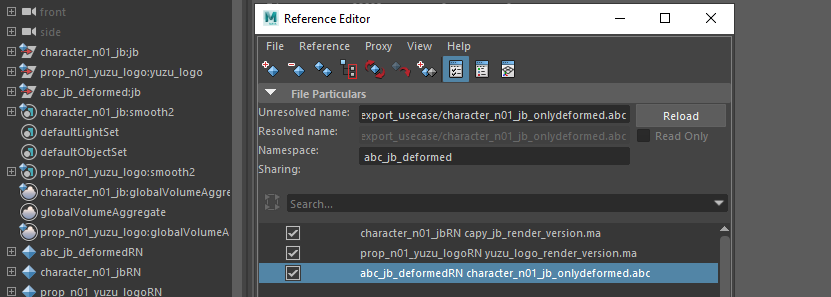
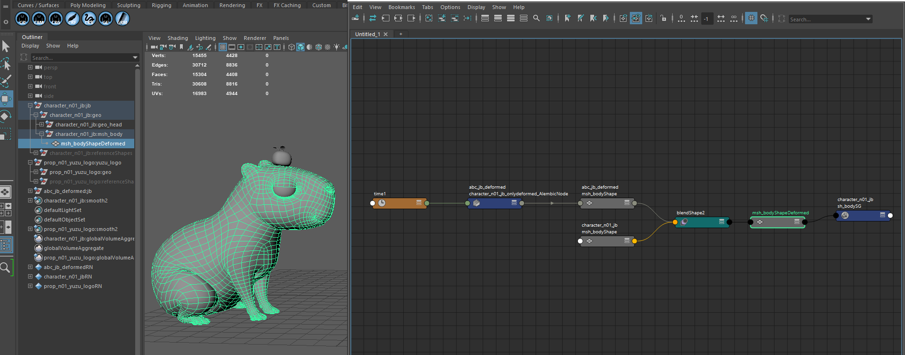

import Tabs from '@theme/Tabs';
import TabItem from '@theme/TabItem';

# Exports from Tangerine to Maya Pipeline

To maximize efficiency, it makes sense to separate steps as much as possible, reducing dependencies between them.
For example, surfacing and UVs for rendering are generally independent of animation (except for animated UV features).

Here is a workflow to keep these steps independent: import the "renderable" version of an asset (UVs, shaders) into Maya and merge it in a controlled way with an Alembic file exported from Tangerine.

## Exporting usefull and optimised data for pipeline chain

Here is an example of connected the exported alembic into maya.
This in not the only way to do it, you would prefer another strategy depending on your pipeline.

Export sample :
`transforms` : contains only values and values lists on transforms node. Will concern only not deformed (bake on vertex) animations.
`all` : contains all animations, deformations on meshs and transforms animations.
`onlyDeformed` : contains transforms animations and meshs that have been deformed in the shot. Usefull to optimise alembic size, for example on sets.

### Bake abc for parts of asset for external software

First exports alembic files with custom content using tags

<details>

  <summary>Command sample exports</summary>

    This sample code is based on scene `three_capy.shot` available in demo package.
    We focus on two assets, `character_n01_jb:jb` and `prop_n01_yuzu_logo:yuzu_logo`.
    ```
    from tang_core.document.get_document import get_document

    from meta_nodal_py import SceneGraphNode, Geometry, SplineCurve
    def getAllHierarchy(node, nodeType=None):
            result = []
            if nodeType == "mesh":
                classInstance = Geometry
            elif nodeType == "spline":
                classInstance = SplineCurve
            elif not nodeType == "group":
                classInstance = SceneGraphNode
            else:
                classInstance = None

            for it in node.depth_first_skippable_iterator():
                node = it.node
                if not isinstance(node, SceneGraphNode) and not isinstance(node, classInstance):
                    it.skip_children()
                elif (classInstance is not None and isinstance(node, classInstance)):
                    result.append(node)
            return result

    def setBakeTagOnNode(bake, node, tagger=None):
        """Helper function to set the :param node: tags "do_bake" and "do_not_bake" according to the :param bakable:
        Perform tag existence check before tagging or untagging.
        if you intend to use this method on a lot of nodes, please provide a tagger with the tags "do_bake" and
            "do_not bake" already created, for performance reasons.

        :param bake: Wether the node shall be tagged bakable or not.
        :type bake: bool
        :param node: Tangerine node instance to change tags
        :type node: Node
        :param tagger: Tagger instance to avoid create a new one each time, defaults to None
        :type tagger: Tagger, Optional
        """

        if not tagger:
            tagger = get_document().tagger
            tagger.create_tag("do_not_bake", show_in_gui=False)
            tagger.create_tag("do_bake", show_in_gui=False)

        if bake:
            if not tagger.has_tag("do_bake", node):
                tagger.tag_node("do_bake", node)
            if tagger.has_tag("do_not_bake", node):
                tagger.untag_node("do_not_bake", node)
        else:
            if tagger.has_tag("do_bake", node):
                tagger.untag_node("do_bake", node)
            if not tagger.has_tag("do_not_bake", node):
                tagger.tag_node("do_not_bake", node)
    ```
    ```python
    from meta_nodal_py import Geometry, DisplayNode, Camera, CrossShapeTool
    from tang_core.abc import is_geom_mesh_modified_from_abc_source, AbcFilesKeepOpen
    from tang_core.document.get_document import get_document
    from tang_core.bake import bake

    document = get_document()

    capyJbAssetNode = document.root().find("character_n01_jb:jb")
    yuzuAssetNode = document.root().find("prop_n01_yuzu_logo:yuzu_logo")
    nodes = [capyJbAssetNode, yuzuAssetNode]

    tagger = document.tagger
    tagger.create_tag("do_not_bake", show_in_gui=False)
    tagger.create_tag("do_bake", show_in_gui=False)

    deformedGeometryNodes = []
    allGeometryChildren = []
    notGeoTranformsHierarchy = []

    with AbcFilesKeepOpen(document) as abc_files_keep_open:
        for node in nodes:
            nothingToBake = True
            for node in node.get_children():
                # disable bake on every part of rig without geometry. Clean and optimize exported alembic files.
                if not node.get_name() == "geo":
                    setBakeTagOnNode(False, node, tagger)
                    continue

                # Get only the "geo" children, to filter parsing on geometry in this sample.
                geoChildren = getAllHierarchy(node, nodeType="mesh")
                for child in geoChildren:
                    allGeometryChildren.append(child)
                    if isinstance(child, Geometry):
                        try:
                            if is_geom_mesh_modified_from_abc_source(child, abc_files_keep_open):
                                deformedGeometryNodes.append(child)
                        except TangValueError as err:
                            # If the node is a Locator, an exception is also raised,
                            inputPlug = child.mesh_in.get_plug_input()
                            if inputPlug and isinstance(inputPlug.get_node(), CrossShapeTool):
                                print("Ignoring locator %s", child.get_name())


    # if you need to export spline, add a bake tag. By default, not baked.
    # for node in nodes:
    #     children = getAllHierarchy(node, nodeType="spline")

    abcExportFolder = "E:/TEMP/Tangerine/Tangerine Demo 2025/api_samples/abc_export_usecase/"

    # First export, we want only transforms in the hierarchy of "geo" node
    for node in allGeometryChildren:
        print(node.get_full_name())
        setBakeTagOnNode(False, node, tagger) # we add a tag on do_not_bake that we will use as a filter in bake abc file

    try:
        bake(
            filename=abcExportFolder + "character_n01_jb_transforms.abc",
            exclude_tag="do_not_bake",
            included_spline_tag="do_bake",
            roots=[capyJbAssetNode],
            write_uv=True, # possible to disblae uv writing
            document=document,
            sub_samples=[],
            write_full_matrix=True,
            start_frame= 1,
            end_frame= document.end_frame,
        )
    except AttributeError:
        print(
            "Error exporting node %s, please check the hierarchy", str([node.get_name() for node in nodes])
        )

    try:
        bake(
            filename=abcExportFolder + "prop_n01_yuzu_logo_transforms.abc",
            exclude_tag="do_not_bake",
            included_spline_tag="do_bake",
            roots=[yuzuAssetNode],
            write_uv=True, # possible to disblae uv writing
            document=document,
            sub_samples=[],
            write_full_matrix=True,
            start_frame= 1,
            end_frame= document.end_frame,
        )
    except AttributeError:
        print(
            "Error exporting node %s, please check the hierarchy", str([node.get_name() for node in nodes])
        )

    # Second export only deformed mesh for jb capy
    for node in deformedGeometryNodes:
        # other geometry still have the do_not_bake_tag.
        setBakeTagOnNode(True, node, tagger) # we add a tag on do_not_bake that we will use as a filter in bake abc file

    try:
        bake(
            filename=abcExportFolder + "character_n01_jb_onlydeformed.abc",
            exclude_tag="do_not_bake",
            included_spline_tag="do_bake",
            roots=[capyJbAssetNode],
            write_uv=True, # possible to disblae uv writing
            document=document,
            sub_samples=[],
            write_full_matrix=True,
            start_frame= 1,
            end_frame= document.end_frame,
        )
    except AttributeError:
        print(
            "Error exporting node %s, please check the hierarchy", str([node.get_name() for node in nodes])
        )
    # Third export all nodes in geometry
    for node in allGeometryChildren:
        # other geometry still have the do_not_bake_tag.
        setBakeTagOnNode(True, node, tagger) # we add a tag on do_not_bake that we will use as a filter in bake abc file

    try:
        bake(
            filename=abcExportFolder + "character_n01_jb_all.abc",
            exclude_tag="do_not_bake",
            included_spline_tag="do_bake",
            roots=[capyJbAssetNode],
            write_uv=True, # possible to disblae uv writing
            document=document,
            sub_samples=[],
            write_full_matrix=True,
            start_frame= 1,
            end_frame= document.end_frame,
        )
    except AttributeError:
        print(
            "Error exporting node %s, please check the hierarchy", str([node.get_name() for node in nodes])
        )

    try:
        bake(
            filename=abcExportFolder + "prop_n01_yuzu_logo_all.abc",
            exclude_tag="do_not_bake",
            included_spline_tag="do_bake",
            roots=[yuzuAssetNode],
            write_uv=True, # possible to disblae uv writing
            document=document,
            sub_samples=[],
            write_full_matrix=True,
            start_frame= 1,
            end_frame= document.end_frame,
        )
    except AttributeError:
        print(
            "Error exporting node %s, please check the hierarchy", str([node.get_name() for node in nodes])
        )
    ```
</details>

## Build you maya scene

To build the renderable Maya scene, we reference:
- The renderable version of assets, containing shaders and associated UVs
- The `onlyDeformed` (or `_all`) Alembic from Tangerine for each asset



Applying animation to our renderable meshes is done in two steps:

1. **Merging "transforms" Alembic onto the renderable hierarchy**
    - This allows transforming "set values" on moved transforms
    - Creates a connection between an Alembic node (transform file) and the animated transforms
    - This process can be repeated multiple times to update animation and set values changes


2. **Connecting meshes of the renderable hierarchy to the deformed ones from Tangerine using blend shapes**
    - This allows handling potential differences in mesh hierarchy in a custom way (without using the AlembicImport algorithm directly)
    - Allows updating UVs on renderable meshes without affecting the animated parts


<details>
  <summary>Command sample exports</summary>

    This sample code is based on the scene `three_capy.shot` available in the demo package.
    You should have your renderable assets referenced in the Maya scene before merging Alembic animation data.

    


    ```python
    def disconnectCustomAttributes(attributes, topNode):
        """
        It is necessary to unplug attribute connections in destination before tu plus an alembic
        cause mergeAbc plug-in won't connect an attribute if there is a destination pluged in the attribute.
        """
        attributesDict = {}
        relativeNodes = cmds.listRelatives(topNode, ad=True, type="transform", f=True) or list()
        relativeNodes = cmds.ls(relativeNodes, exactType="transform", l=True)

        for node in relativeNodes:
            for attribute in attributes:
                if cmds.attributeQuery(attribute, n=node, ex=True):
                    connections = cmds.listConnections(node + "." + attribute, p=True, source=False)
                    if not connections:
                        continue
                    attributesDict.setdefault(node, []).append((attribute, connections))
                    for connection in connections:
                        cmds.disconnectAttr(node + "." + attribute, connection)

        return attributesDict

    def connectCustomAttributes(connectionsDict):
        """
        We reconnecte attribut desination after plug alembic node
        """
        for node, connectionAttributeList in connectionsDict.items():
            for attributeTuple in connectionAttributeList:
                attribute, connections = attributeTuple
                if not connections:
                    continue
                for connection in connections:
                    # test if we have connections from reference
                    if not cmds.listConnections(connection, d=False, s=True):
                        cmds.connectAttr(node + "." + attribute, connection)

    #
    alembicPath = "E:/TEMP/tangerine/Tangerine Demo 2025/api_samples/abc_export_usecase/prop_n01_yuzu_logo_transforms.abc"
    assetTopNode = "prop_n01_yuzu_logo:yuzu_logo"
    assetNamespace = "prop_n01_yuzu_logo"

    # AlembicImport plugin in maya does not know how to deal with attributs already connected, to merge a incoming alembic.
    # We desconnect it for merge, and reconnect them after. You can also use this to force a connection in your render scene, to drive values not from animated alembic from tangerine but another input.
    # searching for every custom attribute of the hierarchy.
    nodesWithCustomAttributs = (
    cmds.ls(
        [assetNamespace + ":c_*", assetNamespace + ":geo_*", assetNamespace + ":grp_*"],
        exactType="transform",
        l=True,
    )
    or list()
    )
    nodesWithCustomAttributs.append(assetTopNode)

    attributes = ["visibility"]
    for controler in nodesWithCustomAttributs:
        customAttributes = cmds.listAttr(controler, ud=True) or list()
        attributes.extend(customAttributes)

    attributesConnections = disconnectCustomAttributes(set(attributes), assetTopNode)

    cmd = 'AbcImport -mode import -connect "%s" "%s";' % (assetTopNode, alembicPath)
    print("executing command : %s" % cmd)
    alembicNode = mel.eval(cmd)

    connectCustomAttributes(attributesConnections)
    ```

    End up with connections made directly by AbcImport plugin
    
</details>

<details>
  <summary>Use blend shapes to transfer animation from Tangerine's Alembic to your renderable hierarchy.</summary>

    ```python
    topNodeAbc = "abc_jb_deformed:jb"
    namespaceAbc= topNodeAbc.split(":")[0]
    namespace = "character_n01_jb"
    childrenShapes = cmds.listRelatives(topNodeAbc, type=["mesh"], ad=True, f=True) or list()
    childrenShapes = list(set(childrenShapes) - set(cmds.ls(childrenShapes, l=True, io=True)))
    childrenMeshs = [x for x in childrenShapes if cmds.objectType(x) == "mesh"]


    # plug blendshape on original hierarchie
    for shape in childrenShapes:
        renderMesh = shape.replace(namespaceAbc + ":", namespace + ":")

        if cmds.objExists(renderMesh) and cmds.objectType(shape) == "mesh":

            # hack disconnect attribute in input
            meshVisibility = cmds.getAttr(renderMesh + ".visibility")
            inputConnections = (
                cmds.listConnections(shape + ".visibility", destination=False, p=True, c=True) or list()
            )
            # If one of the meshes in blendshape is hidden, the command fail. So we show the meshes, and we hide them after blendshape

            for x in range(0, len(inputConnections) - 1, 2):
                cmds.disconnectAttr(inputConnections[x + 1], inputConnections[x])

            # shape has to be visible to be deformable (specificity maya - alembic plugin)
            if meshVisibility is False:
                cmds.setAttr(shape + ".visibility", True)

            # plug blendshape
            try:
                blendShapeName = cmds.blendShape(shape, renderMesh)[0]
                cmds.blendShape(blendShapeName, edit=True, w=(0, 1))
            except RuntimeError:
                pass

            if meshVisibility is False:
                cmds.setAttr(shape + ".visibility", False)

    ```
    At the end, merge with blendshape creation creates a node graph similar to this one

    

</details>

## Add Preroll and Postroll Before Export

Some post-processing steps may require a preroll and postroll in the Alembic file.

When using the export command, you can choose a frame range that is different from the document's
[See bake documentation.](api#export-to-alembic)

```python
bake(
    filename=outputPathLocal,
    exclude_tag="do_not_bake",
    included_spline_tag="do_bake",
    roots=nodes,
    write_uv=True,
    document=document,
    sub_samples=subsamples,
    write_full_matrix=writeFullMatrix,
    start_frame= -20,
    end_frame= 50,
)
```
Usually, you will need to add keys in the preroll section to ensure correct positions, for example when using physics engines.

You can change the frame range for your document by setting `document.start_frame` and `document.end_frame`.

If your animation is already validated and includes dynamics, the dynamics are calculated based on the document's first frame.
Changing the frame range will affect these calculations.

You can bake the dynamics before exporting to preserve the correct results.


```python
from tang_core.callbacks import Callbacks
from tang_core.document.get_document import get_document
from mikan.meta_nodal.lib import dynamic

dynamicControllers = []

document = get_document()

for assetNode in document.root().get_children():
    if not Callbacks().is_asset_node(document, assetNode):
        continue
    dynamicControllers += dynamic.filter_dynamic_controllers(
        Callbacks().get_all_controllers_in_asset(assetNode)
    )

alreadyBakedControllers = dynamic.filter_baked_dynamic_controllers(dynamicControllers)
dynamicControllers = [n for n in dynamicControllers if n not in alreadyBakedControllers]

if dynamicControllers:
    dynamic.bake_dynamic_controllers(dynamicControllers, document)
```
