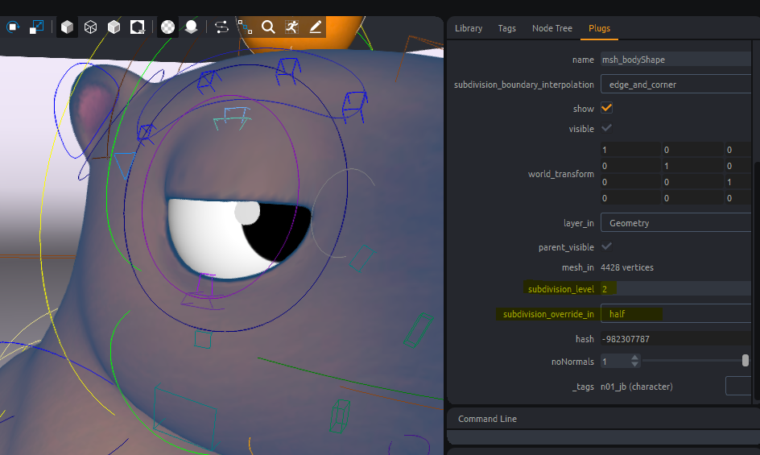

import Tabs from '@theme/Tabs';
import TabItem from '@theme/TabItem';

# Tangerine API

Please see [Tangerine Launching Mode](batch#tangerine-launching-modes) to find the best way for you to develop into Tangerine.
- In the GUI, you will have a `command line` widget. You can copy past your code directly in it and press `Enter`.
You can activate the terminal windows starting Tangerine to have verbosity.


- In batch mode, you can launch tangerine in a terminal adding your script as a parameter.
See detail int [command line part](batch#batch-mode).
```
"E:/TEMP/tangerine/Tangerine Demo 2025/Tangerine/TangerineConsole.exe" --log_to_file --kernel release -l debug --no-hidden --no-gui "E:/TEMP/tangerine/Tangerine Demo 2025/after_opening_tangerine.py" "E:/TEMP/tangerine/Tangerine Demo 2025/hook.py" "E:/TEMP/tangerine/Tangerine Demo 2025/api_samples/three_capy.shot" "E:/TEMP/tangerine/Tangerine Demo 2025/after_loading_document.py"
```


## Modifers

For a matter of optimisation, stack clarity and engine and UI updates, you will need to encapsulate parts of script where you are modifying a document.
When closing a modifier, Tangerine will call every needed callback to compute values and update UI.

The only values of a document that do not need a modifier are `start_frame` and `end_frame`.

:::tip

Use a decorator to inject your modifiers easily
```python
def injectDefaultModifier(method):
    @functools.wraps(method)
    def wrapper(self, *args, **kwargs):
        # Search a modifier in args or kwargs
        modifierInArgs = next(iter(arg for arg in args if isinstance(arg, Modifier)), None)
        modifierInKwargs = kwargs.get("modifier", None)
        modifier = modifierInArgs or modifierInKwargs or None
        if not modifier:
            # Create a default modifier
            doc = get_document()
            modifierName = method.__module__ + "." + method.__name__
            with doc.modify(modifierName, undoable=Undoable.NO_AND_CLEAR_STACK) as modifier:
                # Use modifier in method call
                kwargs["modifier"] = modifier
                return method(self, *args, **kwargs)
        else:
            return method(self, *args, **kwargs)

    return wrapper
```
:::

# Document

A document is the object representing a '.shot' file in Tangerine application.
A document has several attributes. Main ones are :
    `start_frame`, `end_frame`, `file_path`, `fps`, `sound_path`, `sound_offset`

Every nodes references in a document will be under the `root` node.

Any asset node loaded in the document will have a top-node under `root` and all it's hierarchy under.
The top node of a reference is renamed using a namespace if needed.

## Files operations

### Open document

<Tabs>
  <TabItem value="Python Code GUI" label="Python Code Tangerine GUI" default>
```python
# choose the references loading mode
from PySide2.QtWidgets import QApplication
from tang_core.asset.asset_load_mode import AssetLoadMode

TANG_LOAD_MODES = {
    "Load All": AssetLoadMode.ALL,
    "Load None": AssetLoadMode.NONE,
    "Load Default": AssetLoadMode.SAVED,
}

filePath = "[file_path]" # shot file

# get tangerine application instance
app = QApplication.instance()

# for this example we choose to load every reference
tangLoadMode = AssetLoadMode.ALL
# UI mode : specify to Tangerine we load shot file, so we have progression bar and relatives infos in tang
app.main_window.import_shot_files([filePath], load_mode=tangLoadMode)
```
  </TabItem>
  <TabItem value="Python Code batch" label="Python Code Tangerine batch" default>
In this mode, no api.main_window is available. Use following code to load your shot.

```python
from tang_core.document.shot import Shot
from tang_core.document.get_document import get_document

filePath = "[../../my_document_file_path.shot]"

document = get_document()
Shot.import_shot_files([filePath], document)
```
  </TabItem>
  <TabItem value="Package sample" label="Package sample">

```python
from PySide2.QtWidgets import QApplication
from tang_core.asset.asset_load_mode import AssetLoadMode

DEMO_FOLDER_PATH = "E:/TEMP/Tangerine/Tangerine Demo 2025/"

# choose the references loading mode
TANG_LOAD_MODES = {
    "Load All": AssetLoadMode.ALL,
    "Load None": AssetLoadMode.NONE,
    "Load Default": AssetLoadMode.SAVED,
}

filePath = DEMO_FOLDER_PATH + "/jade/jad_anim_217_001.shot" # shot file

# get tangerine application instance
app = QApplication.instance()

# for this example we choose to load every reference
tangLoadMode = AssetLoadMode.ALL
# UI mode : specify to Tangerine we load shot file, so we have progression bar and relatives infos in Tangerine
app.main_window.import_shot_files([filePath], load_mode=tangLoadMode)
```
  </TabItem>
</Tabs>

### Create new document
<Tabs>
  <TabItem value="Python Code GUI" label="Python Code Tangerine GUI" default>
    ```python
    from tang_gui.get_tang_window import get_tang_window

    # defining start and end frames of your shot
    startFrame = 1
    endFrame = 100
    fps = 24

    get_tang_window().do_new_document(self, start_frame=startFrame, end_frame=endFrame, fps=fps):
    ```
  </TabItem>
  <TabItem value="Python Code Batch" label="Python Code Tangerine Batch" default>
    ```python
    from tang_core.asset.asset_load_mode import AssetLoadMode
    from tang_core.document.get_document import get_document

    # defining start and end frames of your shot
    startFrame = 1
    endFrame = 100
    fps = 24

    # creating a document
    document = get_document()
    document.init_new(start_frame=startFrame, end_frame=endFrame, fps=fps)
    ```
  </TabItem>
</Tabs>

### Save document

<Tabs>
  <TabItem value="Python Code" label="Python Code" default>
```python
from tang_core.document.shot import Shot
from tang_core.document.get_document import get_document

filePath = "[file_path]" # shot file

document = get_document()
Shot.export_shot_file(filePath, document)
```
  </TabItem>
  <TabItem value="Package sample" label="Package sample">
```python
from tang_core.document.shot import Shot
from tang_core.document.get_document import get_document

DEMO_FOLDER_PATH = "E:/TEMP/Tangerine/Tangerine Demo 2025/"
filePath = DEMO_FOLDER_PATH + "/api_samples/my_saved_shot_2.shot"

document = get_document()
Shot.export_shot_file(filePath, document)
```
As a result, a .shot file is created

  </TabItem>
</Tabs>


### Add custom document data
Custom data can be added to document using file infos as following.

<Tabs>
  <TabItem value="Python Code" label="Python Code" default>
```python
from tang_core.document.get_document import get_document

name = "[variable_name]" # name of the value you want to store
text = "[you_text]"

# adding a fileinfo of string type
doc = get_document()
doc.set_file_info(name, text)

# getting the value in opened tangerine
fileinfo = doc.get_file_info(name, default=None)
```
  </TabItem>
  <TabItem value="Package sample" label="Package sample">
```python
from tang_core.document.get_document import get_document
# name of the value you want to store
name = "current pipeline version"
text = "1.23.6"

# adding a fileinfo of string type
doc = get_document()
doc.set_file_info(name, text)

# getting the value in opened tangerine
fileinfo = doc.get_file_info(name, default=None)
```
You can save again your file to see the added attribute in ascii.

  </TabItem>
</Tabs>

## Import Alembic File

Mikan is the recommended way to build a rig around geometry stored in an Alembic file.
However, you might sometimes need to visualize geometry directly in Tangerine.
Loading geometry without using Mikan to create a `.tang` asset file will only allow you to view it; you should **not** attempt to animate it.

If you need to use the geometry for anything other than visualization, please use the [Mikan rigging toolbox](https://citrus-software.github.io/mikan-docs/introduction/about) to build a proper asset.


```python
from meta_nodal_py import load_abc
from tang_core.document.get_document import get_document

document = get_document()

DEMO_FOLDER_PATH = "E:/TEMP/Tangerine/Tangerine Demo 2025/"
filePath = DEMO_FOLDER_PATH + "/api_samples/capy_modeling.abc"

# create a abcReaderNode, connect nodes, and a basic rig around
# automatic_instances can be disabled if needed to consider instances independantly
load_abc(document.root(), abc_file_path, automatic_instances=True, force_anim_reader=True)

```

## Document references

### List references

<Tabs>
  <TabItem value="Python Code" label="Python Code" default>
```python

from tang_core.asset.asset import Asset
from tang_core.document.get_document import get_document

def getRootNodes(includeUnloaded=False, asDict=False, assetType=False):
        """
        Return asset nodes.

        :param includeUnloaded: Include assets that are not currently loaded.
        :type includeUnloaded: bool, defaults to False.
        :param asDict: Format return as dict{name: node}.
        :type asDict: bool, defaults to False.
        :param assetType: Include only nodes of type SceneGraphNode.
        :type assetType: bool, defaults to False.
        :rtype: list[node] or dict{name: node} (see :param asDict:).
        """
        document = get_document()

        if assetType:
            nodes = list(Asset.loaded_assets(document))

            if includeUnloaded:
                nodes += list(Asset.unloaded_assets(document))
        else:
            assert not includeUnloaded, "Only Asset nodes can be unloaded."

            nodes = document.root().get_children()

        if asDict:
            return {node.get_name(): node for node in nodes}

        return nodes
```

  </TabItem>
  <TabItem value="Package sample" label="Package sample">

Let's try to get roots node in scene of demo package.
```python
from PySide2.QtWidgets import QApplication
from tang_core.asset.asset_load_mode import AssetLoadMode

DEMO_FOLDER_PATH = "E:/TEMP/Tangerine/Tangerine Demo 2025/"

# opening the scene in tangerine
filePath = DEMO_FOLDER_PATH + "/jade/jad_anim_217_001.shot" # shot file
app = QApplication.instance()
app.main_window.import_shot_files([filePath], load_mode=AssetLoadMode.ALL)

# getting root nodes
nodesDict = assetNodesDict = getRootNodes(asDict=True, assetType=True, includeUnloaded=True)
for nodeName in nodesDict.keys():
    print(nodeName)

```
As a result you will see in your Tangerine's console :
```
camera:cam
character_n01_zhi_xuan:zhi_xuan
character_n01_hui_lin:hui_lin
set_n01_hlj_kwoon_int:hlj_kwoon_int
cyclo_n01_cyclo_hlj_kwoon_int_day:cyclo_hlj_kwoon_int_day
skydome_n01_skydome_day:skydome_day
```
  </TabItem>
</Tabs>

### Add references

An asset file should always have one and only one topnode.
See below how to reference an asset into a shot.

```python
from tang_core.document.get_document import get_document

@modifier
doc = get_document()

filePath = "./capy_jb.tang"
namespace = "character"

# import_nodes(self, name, path, namespace='', modifier=None, asset_state=AssetState.LOADED)
doc.import_nodes(None, filePath, modifier=modifier, namespace=namespace)
@sixtine to test
```
### Remove references


<Tabs>
  <TabItem value="Python Code" label="Python Code" default>
```python
from tang_core.document.get_document import get_document
from tang_core.document.document import Undoable

document = get_document()
node = [root_node] # this is the root node that you want to remove

# use modifier to certify your scene modifications that impacts nodal will be managed properly
with document.modify("removing reference", undoable=Undoable.NO_AND_CLEAR_STACK) as modifier:

    document = get_document()

    # We delete pointers to the node
    nodeName = node.get_name()
    del node

    document.unload_asset_from_name(nodeName, modifier=modifier)
```
  </TabItem>
  <TabItem value="Package sample" label="Package sample">

```python
from PySide2.QtWidgets import QApplication
from tang_core.asset.asset_load_mode import AssetLoadMode
from tang_core.document.get_document import get_document
from tang_core.document.document import Undoable

DEMO_FOLDER_PATH = "E:/TEMP/Tangerine/Tangerine Demo 2025/"

# opening the scene in tangerine
filePath = DEMO_FOLDER_PATH + "/jade/jad_anim_217_001.shot" # shot file
app = QApplication.instance()
app.main_window.import_shot_files([filePath], load_mode=AssetLoadMode.ALL)

document = get_document()
node = document.root().find("character_n01_hui_lin:hui_lin") # only asset nodes can be removed.

with document.modify("removing reference", undoable=Undoable.NO_AND_CLEAR_STACK) as modifier:

    # We delete pointers to the node
    nodeName = node.get_name() # name of the top node of the asset
    print("Removing node %s" % nodeName)
    del node

    document.unload_asset_from_name(nodeName, modifier=modifier)
```
See the result in your node tree or in the asset manager.


  </TabItem>
</Tabs>

:::tip
It is necessary to remove any pointer to a node that you want to remove.
`del node`
:::

### Edit references path

<Tabs>
  <TabItem value="Python Code" label="Python Code" default>
```python
from tang_core.asset.asset_loader import AssetLoader
from tang_core.document.get_document import get_document

doc = get_document()

newfilePath = "[new_tang_file_path]" # path of Tangerine asset file you want to use
nodeName = node.get_name()

with document.modify("update reference path", undoable=Undoable.NO_AND_CLEAR_STACK) as modifier:
    del node
    AssetLoader.replace_asset(nodeName, newfilePath, modifier)

```
  </TabItem>
  <TabItem value="Package sample" label="Package sample">

```python
from tang_core.asset.asset_loader import AssetLoader
from tang_core.document.get_document import get_document

doc = get_document()

DEMO_FOLDER_PATH = "E:/TEMP/Tangerine/Tangerine Demo 2025/"
newfilePath = DEMO_FOLDER_PATH + "/Jade/Assets/jad_release-anim_zhi-xuan_v000.tang"

node = document.root().find("character_n01_hui_lin:hui_lin")
nodeName = node.get_name()

with document.modify("update reference path", undoable=Undoable.NO_AND_CLEAR_STACK) as modifier:
    del node
    AssetLoader.replace_asset(nodeName, newfilePath, modifier)
```
  </TabItem>
</Tabs>

### Rename reference node

<Tabs>
  <TabItem value="Python Code" label="Python Code" default>
```python
from tang_core.document.document import Undoable
from tang_core.document.get_document import get_document

doc = get_document()

# We want to rename node
nodeName = node.get_name() # node is the node you want to rename
newName = "[new_asset_name]"

with doc.modify("rename_%s_to_%s" % (nodeName, newName), undoable=Undoable.NO_AND_CLEAR_STACK) as modifier:
    modifier.rename_node(assetNodesDict[nodeName], newName)
```
  </TabItem>
  <TabItem value="Package sample" label="Package sample">

```python
from PySide2.QtWidgets import QApplication
from tang_core.asset.asset_load_mode import AssetLoadMode
from tang_core.document.get_document import get_document
from tang_core.document.document import Undoable

DEMO_FOLDER_PATH = "E:/TEMP/Tangerine/Tangerine Demo 2025/"

# opening the scene in tangerine
filePath = DEMO_FOLDER_PATH + "/jade/jad_anim_217_001.shot" # shot file
app = QApplication.instance()
app.main_window.import_shot_files([filePath], load_mode=AssetLoadMode.ALL)

document = get_document()

# We want to rename node
node = document.root().find("character_n01_hui_lin:hui_lin/geo")
nodeName = node.get_full_name() # node is the node you want to rename
newName = "geometry"

with document.modify("rename_%s_to_%s" % (nodeName, newName), undoable=Undoable.NO_AND_CLEAR_STACK) as modifier:
    modifier.rename_node(node, newName)

# Or if you want to change a namespace
node = document.root().find("character_n01_hui_lin:hui_lin")
nodeName = node.get_full_name() # node is the node you want to rename
newName = "character_kung_fu:hui_lin"

with document.modify("rename_%s_to_%s" % (nodeName, newName), undoable=Undoable.NO_AND_CLEAR_STACK) as modifier:
    modifier.rename_node(node, newName)

```
  </TabItem>
</Tabs>

## Playblasting

### Create playblast settings

Create a `PlayblastSettings` object to specify the characteristics of your playblast, such as SSAO, camera, time range, and more.

```python
from tang_core.playblast.playblast_settings import PlayblastSettings
from tang_core.document.get_document import get_document

width = 1280
height = 720

document = get_document()
startFrame = document.start_frame
endFrame = document.end_frame


playblastSettings = PlayblastSettings(start=startFrame, end=endFrame, width=width, height=height)

playblastSettings.export_audio = False
playblastSettings.texture = True
playblastSettings.smooth = True

playblastSettings.auto_open = False # Open folder of exported playblast at the end
playblastSettings.overwrite = True # Authorize overwriting output files is already exists
playblastSettings.ignore_types = "Joint,Curve" # Do not include in viewport these types of objects, could be also grid,tool,corneas,__dummies__

playblastSettings.enable_ssao = True
playblastSettings.ssao_kernel_size = 64
playblastSettings.ssao_power = 2.0
playblastSettings.ssao_radius = 0.3
```

### Launch playblast settings

```python
from tang_core.document.get_document import get_document
from tang_core.playblast.playblast import Playblast

document = get_document()

# search for the camera node in scene you want to use for playblast
camera = "cameras/persp/Persp"
cameraNode = document.root().find(camera)

imagePath = "E:/TEMP/Tangerine/Tangerine Demo 2025/api_samples/playblast_folder/my_playblast_images.jpg"

Playblast.playblast(document, cameraNode, imagePath, settings=playblastSettings) # see previous part to create playblast settings
```

### Viewport subdivision

To apply subdivision, use the following lines of code.
The subdivision values you set here will be used if the "smooth" option in the Playblast settings is enabled.

```python
from tang_core.shape import SubdivisionOverride, set_general_subdivision_override
from tang_core.document.get_document import get_document

document = get_document()

# choose subdivision value, ON = full smooth value, HALF_LEVEL = Half the smooth value, OFF = not smoothed at all
subdivOverride = SubdivisionOverride.ON
with document.modify("subdiv_override") as modifier:
    set_general_subdivision_override(subdivOverride, modifier)
```

You can see level of subdivision applied, in plugs view selecting a mesh.
The subdivision value used is the value stored in plug `subdivision_level`


If you need some mesh to have different subdivision properties, use these lines:

<Tabs>
  <TabItem value="Python Code" label="Python Code" default>
```python
from tang_core.shape import SubdivisionOverride, set_subdivision_override
from tang_core.document.get_document import get_document

document = get_document()

subdivOverride = SubdivisionOverride.OFF  # ON = full smooth value, HALF_LEVEL = Half the smooth value, OFF = not smoothed at all

mesh = [YOUR_NODE] # node of type Geometry
with document.modify("subdiv_override") as modifier:
    set_subdivision_override(mesh, subdivOverride, modifier)

```
  </TabItem>
  <TabItem value="Package sample" label="Package sample">
```python
from tang_core.shape import SubdivisionOverride, set_subdivision_override, set_general_subdivision_override
from tang_core.asset.asset_load_mode import AssetLoadMode
from tang_core.document.get_document import get_document
from PySide2.QtWidgets import QApplication
from meta_nodal_py import Geometry

# opening scene
DEMO_FOLDER_PATH = "E:/TEMP/Tangerine/Tangerine Demo 2025/"
filePath = DEMO_FOLDER_PATH + "/api_samples/three_capy.shot" # shot file
app = QApplication.instance()
app.main_window.import_shot_files([filePath], load_mode=AssetLoadMode.ALL)

document = get_document()

# set full subdivision on all meshs of the scene
subdivOverride = SubdivisionOverride.ON
with document.modify("subdiv_override") as modifier:
    set_general_subdivision_override(subdivOverride, modifier)

# set OFF subdivision on set hierarchy
assetNode = document.root().find("set_n01_white_neutral_int:white_neutral_int")
# listing Geometry nodes in assetNode hierarchy
subdivOverride = SubdivisionOverride.OFF  # ON = full smooth value, HALF_LEVEL = Half the smooth value, OFF = not smoothed at all
with document.modify("subdiv_override") as modifier:
    for it in assetNode.depth_first_skippable_iterator():
        node = it.node
        if isinstance(node, Geometry):
            print(node.get_name())
            set_subdivision_override(node, subdivOverride, modifier)
```
  </TabItem>
</Tabs>

## Tags

Tags allow you to group elements in your hierarchy for quick access.
They can be used for various purposes, such as [baking with tags](usecase/#bake-tag-for-alembic).
For example, Tangerine uses tags to enable fast selection in the UI.

```python
from tang_core.document.get_document import get_document

tagger = get_document().tagger
super_tag = tagger.create_tag("YOUR_SUPER_TAG_NAME", show_in_gui=True)
tag = tagger.create_tag("YOUR_TAG_NAME", super_tag=super_tag, show_in_gui=True) # YOUR_TAG_NAME will also be considered as a YOUR_SUPER_TAG_NAME tag. You can think of it as inheritance in OOP.

nodes = [YOUR_NODE]
for node in nodes:
  tagger.tag_node(tag, node)
```

## Export

### Alembic Format

Tags can be used to a slector for bake action.
You can use them to optimize your Alembic data, ensuring that only the necessary elements are included for the post-production workflow.
See the use cases section for examples.

#### Export to alembic

<Tabs>
  <TabItem value="Python Code" label="Python Code" default>

```python
from tang_core.bake import bake
from tang_core.document.get_document import get_document

outputPath = "YOUR_ABC_EXPORT_PATH.abc" # Path on the server where the alembic file will be saved. Folders should exists before export.
nodes = [YOUR_NODE] # Tangerine nodes to export as alembic

locators = False
writeFullMatrix = False
subsamples = [-0.125, 0.125] # subsamples to export, [] for no subsamples export

document = get_document()

try:
    bake(
        filename=outputPath,
        roots=nodes,
        write_uv=True, # possible to disblae uv writing
        document=document,
        sub_samples=subsamples,
        write_full_matrix=writeFullMatrix, # force exporting matrix values instead of each component values
        start_frame=document.start_frame,
        end_frame=document.end_frame,
    )
except AttributeError:
    print(
        "Error exporting node %s, please check the hierarchy", str([node.get_name() for node in nodes])
    )
```
  </TabItem>
  <TabItem value="Package sample" label="Package sample">

```python
from PySide2.QtWidgets import QApplication
from tang_core.asset.asset_load_mode import AssetLoadMode
from tang_core.document.get_document import get_document
from tang_core.bake import bake
from meta_nodal_py import SceneGraphNode, Geometry, SplineCurve
#  or isinstance(node, SplineCurve) or isinstance(node, SplineCurve):
DEMO_FOLDER_PATH = "E:/TEMP/Tangerine/Tangerine Demo 2025/"
filePath = DEMO_FOLDER_PATH + "/api_samples/three_capy.shot" # shot file
# opening the scene in tangerine
app = QApplication.instance()
app.main_window.import_shot_files([filePath], load_mode=AssetLoadMode.ALL)

document = get_document()

outputPath = DEMO_FOLDER_PATH + "api_samples/my_exported_abc.abc" # Path on the server where the alembic file will be saved. Folders should exists before export.
assetNode = document.root().find("character_n01_jb:jb") # asset node

locators = False
writeFullMatrix = False
subsamples = [-0.125, 0.125] # subsamples to export, [] for no subsamples export

tagger = get_document().tagger
tag = tagger.create_tag("DO_BAKE_NODE", show_in_gui=True)
for it in assetNode.depth_first_skippable_iterator():
    node = it.node
    if isinstance(node, (Geometry, SceneGraphNode, SplineCurve)):
      tagger.tag_node(tag, node)
tagger.tag_node(tag, assetNode)

# disable bake on every part of rig without geometry. Clean and optimize exported alembic files.
noBakeTag = tagger.create_tag("DO_NOT_BAKE_NODE", show_in_gui=True)
for node in assetNode.get_children():
  if not node.get_name() == "geo":
      tagger.tag_node(noBakeTag, node)


try:
    bake(
        filename=outputPath,
        exclude_tag="DO_NOT_BAKE_NODE",
        included_spline_tag="DO_BAKE_NODE",
        roots=[node],
        write_uv=True, # possible to disblae uv writing
        document=document,
        sub_samples=subsamples,
        write_full_matrix=writeFullMatrix,
        start_frame=1,
        end_frame=document.end_frame,
    )
except AttributeError:
    print(
        "Error exporting node %s, please check the hierarchy", str([node.get_name() for node in nodes])
    )
```
Here we exported a full hierarchy as an Alembic file.
See the use cases section for an example of an exported Alembic that can be used in your pipeline with tags.
  </TabItem>
</Tabs>

### Export .tang Asset File

`.tang` asset files are normally generated using the Mikan rigging toolkit.
However, if you need to integrate unrigged geometry, you can use the export asset feature to create a `.tang` file.

```python
from tang_core.document.get_document import get_document

DEMO_FOLDER_PATH = "E:/TEMP/Tangerine/Tangerine Demo 2025/"
filePath = DEMO_FOLDER_PATH + "/api_samples/my_node_asset_file.abc"
document = get_document()
node = document.root().find("character_jb:capy_modeling")

document.export_asset(node, path) @sixtine test
```

## Nodes

### Get Asset Nodes from selection

```python
from tang_core.document.get_document import get_document
from tang_core.asset.asset import Asset
from meta_nodal_py import SceneGraphNode

document = get_document()

nodes = []

for node in document.node_selection():
    if type(node) == SceneGraphNode and Asset.is_asset(node.get_name()) and Asset.is_asset_loaded(node):
        nodes.append(node)

nodeDict = {node.get_name(): node for node in nodes}
print(nodeDict.keys())
```
### Access Nodes, Controllers, and Plugs

You can manipulate nodes within your scene.
Some nodes have special functions, such as Asset nodes. These specific nodes are defined as the main nodes of a referenced asset by `Mikan`.

<Tabs>
  <TabItem value="Python Code" label="Python Code" default>

  Be sure this script is a startup script, so UI will update at the end only once.
  If not, use a modifier for your creation nodes @sixtine
```python
from tang_core.callbacks import Callbacks
from tang_core.document.get_document import get_document
import meta_nodal_py as kl

# get a root node
document = get_document()
rootNodeName = "[name_of_a_root_node]" # this is the name of a root node
assetNode = document.root().find(rootNodeName) # finding your node

# create a node
trash = kl.SceneGraphNode(document.root(), "trash")

# delete a node
trash.remove_from_parent()
del trash

# list children
children = assetNode.get_children()
for child in children:
    print(child.get_full_name())

# hide a node
assetNode.show.set_value(False)

# get a controller in asset hierarchy, using Mikan Callbacks
ctrl = "CONTROL_NAME" #
node = Callbacks().find_controller_in_asset(assetNode, ctrl)

# Plugs
# list plugs of a node
plugs = node.get_plugs()

# get a plug on node
attribute = "NAME_OF_ATTRIBUTE"
plug = node.get_plug(attribute)
```
  </TabItem>
  <TabItem value="Package sample" label="Package sample">

```python
from tang_core.callbacks import Callbacks
from tang_core.document.get_document import get_document
from PySide2.QtWidgets import QApplication
from tang_core.asset.asset_load_mode import AssetLoadMode
import meta_nodal_py as kl

# opening scene
DEMO_FOLDER_PATH = "E:/TEMP/Tangerine/Tangerine Demo 2025/"
filePath = DEMO_FOLDER_PATH + "/api_samples/three_capy.shot" # shot file
app = QApplication.instance()
tangLoadMode = AssetLoadMode.ALL
app.main_window.import_shot_files([filePath], load_mode=tangLoadMode)

document = get_document()

# create a node
trash = kl.SceneGraphNode(document.root(), "trash")

# delete a node
trash.remove_from_parent()
del trash

# get a root node
rootNodeName = "character_n01_jb:jb" # this is the name of a root node
assetNode = document.root().find(rootNodeName) # finding your node

# list children
children = assetNode.get_children()
for child in children:
    print(child.get_full_name())

# hide a node
assetNode.show.set_value(False)

# get a controller in asset hierarchy
ctrl = "move" # name of a controler you are searching for
ctrlNode = Callbacks().find_controller_in_asset(assetNode, ctrl)

# Plugs
# list plugs
nodePlugs = ctrlNode.get_dynamic_plugs()
for plug in nodePlugs:
    print("%s.%s" % (ctrlNode, plug.get_name()))

# get a specific attribut plug
attribute = "tx"
plug = ctrlNode.get_plug(attribute)

print(plug.get_full_name())

```
  </TabItem>
</Tabs>

## Animation

### Import Animation, Anim layers and contraints from file

To come

### List animated plugs, considering each anim layer

<Tabs>
  <TabItem value="Python Code" label="Python Code" default>
    ```python
    ```
  </TabItem>
  <TabItem value="Package sample" label="Package sample">
    ```python
    from tang_core.anim import find_anim_node
    from tang_core.layer import former_plug_to_layer_plug, has_layer_plugs
    from tang_core.callbacks import Callbacks

    def getAnimatedPlugs(plug)
        """Return a list of plug with animation, considering anim layers."""
        # get plug if animated, or get associated layers plugs instead if plug is connected to layers
        if has_layer_plugs(plug):
            animatedPlugs = []
            for layer in layers:
                layer_plug = former_plug_to_layer_plug(plug, layer)
                if layer_plug:
                    anim_node = find_anim_node(layer_plug)
                    if anim_node:
                        animatedPlugs.append(layer_plug)
            return animatedPlugs
        else:
            anim_node = find_anim_node(plug)
            if anim_node:
                return [plug]
        return []

    ctrlNames = ["world", "move", "c_fly", "c_center", "c_camera_pos"] # filtering on nodes
    attrNames = ["tx", "ty", "tz", "rx", "ry", "rz"] # filtering on attributs

    ### parsing scene nodes to find plug with animation
    rootNodes = getRootNodes(assetType=True) # get this method definition
    for rootNode in rootNodes:
        for ctrl in Callbacks().get_all_controllers_in_asset(rootNode):
            plugs = [plug for plug in ctrl.get_plugs() if plug.get_name() in attrNames]
            for plug in plugs:
                animatedPlugs = soft.getAnimatedPlugs(plug, layers=layers)
                for animatedPlug in animatedPlugs:
                    anim_node = find_anim_node(animatedPlug)
    ```
  </TabItem>
</Tabs>

## Image plane and animation references

A tool is available for animators to see in their camera image or image sequences references.
This tool is called "animation reference" and can be pre-configured in the pipeline as following.

```python
document = get_document()
imgPath = "E:/TEMP/Maya/Tangerine Demo 2025/api_samples/image_plane_sequence/anim_reference_image_plane.001.jpg"

ref = document.animation_references.register(imgPath)
ref.label = "animatic"
```

If you need to create a specific image plane in your shot, you can create the following nodes by script.
Adding it to your asset trough Mikan features would be the best practise but sometimes you only need the node in animation and want to keep your cameras `.tang` clean.

...sample to come...

```python
from tang_core.camera import create_image_plane
from tang_core.document.get_document import get_document
from meta_nodal_py import Imath, ImageSequenceToImagePath, Path, CurrentFrame, FloatToInt, Node
from tang_core.document.document import Undoable

image_plane_sequence_path = "E:/TEMP/Maya/Tangerine Demo 2025/api_samples/image_plane_sequence/ctr_anim_scenettes-demo-chars_jb-capy-cute_v000.###.jpg"

document = get_document()

cameraName = "cameras/shot/Shot" # camera Shape node
cameraNode = document.root().find(cameraName)

cameraTransform = cameraNode.get_parent()
verticalApp = cameraNode.vertical_aperture.get_value(1)
horizontalApp = cameraNode.horizontal_aperture.get_value(1)

size = Imath.V2f(horizontalApp, verticalApp)
with document.modify("image plane", undoable=Undoable.NO) as modifier:

    imagePlane = create_image_plane(
        cameraNode,
        modifier,
        image_path="",
        name="image_plane_001",
        size=size,
    )
    sequence_to_path = ImageSequenceToImagePath(imagePlane, "sequence_to_path")
    sequence_to_path.image_sequence_path.set_value(Path(image_plane_sequence_path))

    current_frame = modifier.create_node(CurrentFrame, imagePlane, 'current_frame')
    current_frame_int = modifier.create_node(FloatToInt, imagePlane, 'current_frame_int')
    modifier.connect_plugs(current_frame_int.input, current_frame.result)
    modifier.connect_plugs(sequence_to_path.frame, current_frame_int.output)

    modifier.connect_plugs(imagePlane.image_path, sequence_to_path.image_path)

    if hasattr(cameraTransform, "imageplane_depth"):
        modifier.connect_plugs(imagePlane.depth, cameraTransform.imageplane_depth)
# Think about to disable baking imagePlaneShape when exporting the camera

```
