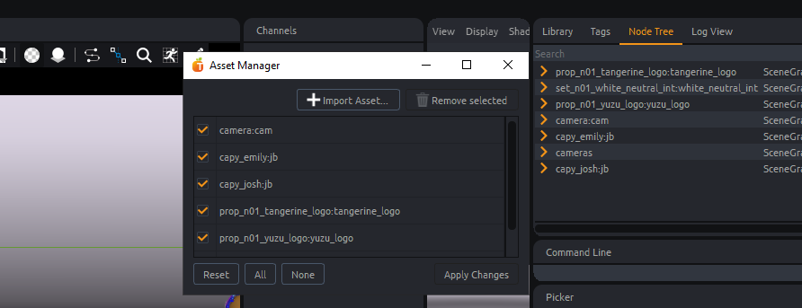

import Tabs from '@theme/Tabs';
import TabItem from '@theme/TabItem';

# Tangerine API

Please see [Tangerine Launching Mode](batch#tangerine-launching-modes) to find the best way for you to develop into Tangerine.
- In the GUI, you will have a `command line` widget. You can copy past your code directly in it and press `Enter`.
You can activate the terminal windows starting Tangerine to have verbosity.


- In batch mode, you can launch tangerine in a terminal adding your script as a parameter.
See detail int [command line part](batch#batch-mode).
```
"E:/TEMP/tangerine/Tangerine Demo 2025/Tangerine/TangerineConsole.exe" --log_to_file --kernel release -l debug --no-hidden --no-gui "E:/TEMP/tangerine/Tangerine Demo 2025/after_opening_tangerine.py" "E:/TEMP/tangerine/Tangerine Demo 2025/hook.py" "E:/TEMP/tangerine/Tangerine Demo 2025/api_tests/three_capy.shot" "E:/TEMP/tangerine/Tangerine Demo 2025/after_loading_document.py"
```


## Modifers

For a matter of optimisation and stack clarity, you will need to encasulate parts of script where you are editing values of a node.
This way, Tangerine meta_nodal is able to find the appropriate moment compute everything and give you a feedback of your editing.

:::tip

Use a decorator to inject your modifiers easily
```python
def injectDefaultModifier(method):
    @functools.wraps(method)
    def wrapper(self, *args, **kwargs):
        # Search a modifier in args or kwargs
        modifierInArgs = next(iter(arg for arg in args if isinstance(arg, Modifier)), None)
        modifierInKwargs = kwargs.get("modifier", None)
        modifier = modifierInArgs or modifierInKwargs or None
        if not modifier:
            # Create a default modifier
            doc = get_document()
            modifierName = method.__module__ + "." + method.__name__
            with doc.modify(modifierName, undoable=Undoable.NO_AND_CLEAR_STACK) as modifier:
                # Use modifier in method call
                kwargs["modifier"] = modifier
                return method(self, *args, **kwargs)
        else:
            return method(self, *args, **kwargs)

    return wrapper
```
:::

# Document

A document is the object representing a '.tang' file in Tangerine application.
A document contains data such as :
    - `anims` : Animation curves
    - `actions` : Plug values
    - timeline informations
    - configurations informations (library path for example)
    - additional file informations (custom saved data)

A document can reference:
- a sound file (wav format) @max @seb c'est quoi les caractéristiques encessaires son ?
- alembic files @max @seb quel type alembic, ogawa uniquement ? version min ?
- .tang files, rigged assets

An asset is : .....
@seb @max how to talk about this ?

## Files operations

### Open document

<Tabs>
  <TabItem value="Pyton Code GUI" label="Python Code Tangerine GUI" default>
```python
# choose the references loading mode
from PySide2.QtWidgets import QApplication
from tang_core.asset.asset_load_mode import AssetLoadMode

TANG_LOAD_MODES = {
    "Load All": AssetLoadMode.ALL,
    "Load None": AssetLoadMode.NONE,
    "Load Default": AssetLoadMode.SAVED,
}

filePath = "[file_path]" # shot file

# get tangerine application instance
app = QApplication.instance()

# for this example we choose to load every reference
tangLoadMode = AssetLoadMode.ALL
# UI mode : specify to Tangerine we load shot file, so we have progression bar and relatives infos in tang
app.main_window.import_shot_files([filePath], load_mode=tangLoadMode)
```
  </TabItem>
  <TabItem value="Pyton Code batch" label="Python Code Tangerine batch" default>
In this mode, no api.main_window is available. Use following code to load your shot.

```python
from tang_core.document.shot import Shot

filePath = "[../../my_document_file_path.shot]"

document = get_document()
Shot.import_shot_files([filePath], document)
```
  </TabItem>
  <TabItem value="Package sample" label="Package sample">

```python
from PySide2.QtWidgets import QApplication
from tang_core.asset.asset_load_mode import AssetLoadMode

DEMO_FOLDER_PATH = "E:/TEMP/Maya/Tangerine Demo 2025/"

# choose the references loading mode
TANG_LOAD_MODES = {
    "Load All": AssetLoadMode.ALL,
    "Load None": AssetLoadMode.NONE,
    "Load Default": AssetLoadMode.SAVED,
}

filePath = DEMO_FOLDER_PATH + "/jade/jad_anim_217_001.shot" # shot file

# get tangerine application instance
app = QApplication.instance()

# for this example we choose to load every reference
tangLoadMode = AssetLoadMode.ALL
# UI mode : specify to Tangerine we load shot file, so we have progression bar and relatives infos in Tangerine
app.main_window.import_shot_files([filePath], load_mode=tangLoadMode)
```
  </TabItem>
</Tabs>

### Create new document
```python
from tang_core.asset.asset_load_mode import AssetLoadMode
from tang_core.document.get_document import get_document

# defining start and end frames of your shot
startFrame = 1
endFrame = 100
fps = 24

# creating a document
doc = get_document()
doc.init_new(start_frame=startFrame, end_frame=endFrame, fps=fps) # @seb @ max ne prends pas le 100

# setting actual document filePath. will be stored in a file only at save.
doc.file_path = filePath
```

### Save document

<Tabs>
  <TabItem value="Pyton Code" label="Python Code" default>
```python
from tang_core.document.shot import Shot
from tang_core.document.get_document import get_document

filePath = "[file_path]" # shot file

doc = get_document()
Shot.export_shot_file(filePath, doc)
```
  </TabItem>
  <TabItem value="Package sample" label="Package sample">
```python
from tang_core.document.shot import Shot
from tang_core.document.get_document import get_document

DEMO_FOLDER_PATH = "E:/TEMP/Maya/Tangerine Demo 2025/"
filePath = DEMO_FOLDER_PATH + "/api_tests/my_saved_shot_2.shot"

doc = get_document()
Shot.export_shot_file(filePath, doc)
```
As a result, a .shot file is created

  </TabItem>
</Tabs>


### Add custom document data
Custom data can be added to document using file infos as following.

<Tabs>
  <TabItem value="Pyton Code" label="Python Code" default>
```python
from tang_core.document.get_document import get_document

name = "[variable_name]" # name of the value you want to store
text = "[you_text]"

# adding a fileinfo of string type
doc = get_document()
doc.set_file_info(name, text)

# getting the value in opened tangerine
fileinfo = doc.get_file_info(name, default=None)
```
  </TabItem>
  <TabItem value="Package sample" label="Package sample">
```python
from tang_core.document.get_document import get_document
# name of the value you want to store
name = "current pipeline version"
text = "1.23.6"

# adding a fileinfo of string type
doc = get_document()
doc.set_file_info(name, text)

# getting the value in opened tangerine
fileinfo = doc.get_file_info(name, default=None)
```
You can save again your file to see the added attribute in ascii.

  </TabItem>
</Tabs>

## Import alembic file
@seb and @max comment o nexpliquerai les besoin de faire un asset plutôt qu'un juste load d'abc ? quel usage case? ou alors ça debloque quoi du point de vu tangerine ?
J'ai le use case de on a pas de rig on veut loader un plaque ou un decors non riggé. Mais pourquoi enfait un asset et pas juste un load abc ?

### option 1 : Load an alembic file in Tangerine
@seb @max l'attribut automatic_instances c'est ok ce que je raconte ?
```python
from meta_nodal_py import load_abc
from tang_core.document.get_document import get_document

doc = get_document()

DEMO_FOLDER_PATH = "E:/TEMP/Maya/Tangerine Demo 2025/"
filePath = DEMO_FOLDER_PATH + "/api_tests/capy_modeling.abc"

# When creating the ReleaseModel of crowd assets, disable it.
load_abc(doc.root(), filePath, automatic_instances=True) # automatic_instances can be disabled if needed to consider instances independantly
```
### option 2 : Create an asset around alembic file

To import alembic file containg geometry as an asset, use following lines.

```python
from tang_core.document.get_document import get_document

doc = get_document()

DEMO_FOLDER_PATH = "E:/TEMP/Maya/Tangerine Demo 2025/"
filePath = DEMO_FOLDER_PATH + "/api_tests/capy_modeling.abc"
namespace = "character_jb"
doc.import_abc_in_new_asset(filePath, namespace=namespace)
```

## Document references

### list references


<Tabs>
  <TabItem value="Pyton Code" label="Python Code" default>
```python

from tang_core.asset.asset import Asset
from tang_core.document.get_document import get_document

def getRootNodes(includeUnloaded=False, asDict=False, assetType=False):
        """
        Return asset nodes.

        :param includeUnloaded: Include assets that are not currently loaded.
        :type includeUnloaded: bool, defaults to False.
        :param asDict: Format return as dict{name: node}.
        :type asDict: bool, defaults to False.
        :param assetType: Include only nodes of type SceneGraphNode.
        :type assetType: bool, defaults to False.
        :rtype: list[node] or dict{name: node} (see :param asDict:).
        """
        doc = get_document()

        if assetType:
            nodes = list(Asset.loaded_assets(doc))

            if includeUnloaded:
                nodes += list(Asset.unloaded_assets(doc))
        else:
            assert not includeUnloaded, "Only Asset nodes can be unloaded."

            nodes = doc.root().get_children()

        if asDict:
            return {node.get_name(): node for node in nodes}

        return nodes
```

  </TabItem>
  <TabItem value="Package sample" label="Package sample">

Let's try to get roots node in scene of demo package.
```python
from PySide2.QtWidgets import QApplication
from tang_core.asset.asset_load_mode import AssetLoadMode

DEMO_FOLDER_PATH = "E:/TEMP/Maya/Tangerine Demo 2025/"

# opening the scene in tangerine
filePath = DEMO_FOLDER_PATH + "/jade/jad_anim_217_001.shot" # shot file
app = QApplication.instance()
app.main_window.import_shot_files([filePath], load_mode=AssetLoadMode.ALL)

# getting root nodes
nodesDict = assetNodesDict = getRootNodes(asDict=True, assetType=True, includeUnloaded=True)
for nodeName in nodesDict.keys():
    print(nodeName)

```
As a result you will see in your tangerine's console :
```
camera:cam
character_n01_zhi_xuan:zhi_xuan
character_n01_hui_lin:hui_lin
set_n01_hlj_kwoon_int:hlj_kwoon_int
cyclo_n01_cyclo_hlj_kwoon_int_day:cyclo_hlj_kwoon_int_day
skydome_n01_skydome_day:skydome_day
```
  </TabItem>
</Tabs>

### adding references

@seb @max, on a toujours une limite de un seul top node dans l'abc ? et est ce que on doit connaitre le nom du top node? ou ya une autre méthodo ?
```python
from tang_core.document.get_document import get_document

@modifier
doc = get_document()

filePath = "./my_abc_file.abc"
namespace = "character_cube"

doc.import_nodes(namespace + ":" + topnode, filePath, modifier=modifier)
```
### remove references


<Tabs>
  <TabItem value="Pyton Code" label="Python Code" default>
```python
from tang_core.document.get_document import get_document
from tang_core.document.document import Undoable

document = get_document()
node = [root_node] # this is the root node that you want to remove

# use modifier to certify your scene modifications that impacts nodal will be managed properly
with document.modify("removing reference", undoable=Undoable.NO_AND_CLEAR_STACK) as modifier:

    document = get_document()

    # We delete pointers to the node
    nodeName = node.get_name()
    del node

    document.unload_asset_from_name(nodeName, modifier=modifier)
```
  </TabItem>
  <TabItem value="Package sample" label="Package sample">

```python
from PySide2.QtWidgets import QApplication
from tang_core.asset.asset_load_mode import AssetLoadMode
from tang_core.document.get_document import get_document
from tang_core.document.document import Undoable

DEMO_FOLDER_PATH = "E:/TEMP/Maya/Tangerine Demo 2025/"

# opening the scene in tangerine
filePath = DEMO_FOLDER_PATH + "/jade/jad_anim_217_001.shot" # shot file
app = QApplication.instance()
app.main_window.import_shot_files([filePath], load_mode=AssetLoadMode.ALL)

document = get_document()
node = document.root().find("character_n01_hui_lin:hui_lin") # only asset nodes can be removed.

with document.modify("removing reference", undoable=Undoable.NO_AND_CLEAR_STACK) as modifier:

    document = get_document()

    # We delete pointers to the node
    nodeName = node.get_name() #@seb et @max, si je fais full name il m'envoie boulé.
    del node

    document.unload_asset_from_name(nodeName, modifier=modifier)
```
See the result in your node tree or in the asset manager.


  </TabItem>
</Tabs>

:::tip
It is necessary to remove any pointer to a node that you want to remove.
`del node`
:::

### edit references path

<Tabs>
  <TabItem value="Pyton Code" label="Python Code" default>
```python
from tang_core.asset.asset_loader import AssetLoader
from tang_core.document.get_document import get_document

doc = get_document()

newfilePath = "[new_tang_file_path]" # path of Tangerine asset file you want to use
nodeName = node.get_name()

with document.modify("update reference path", undoable=Undoable.NO_AND_CLEAR_STACK) as modifier:
    del node
    AssetLoader.replace_asset(nodeName, newfilePath, modifier)

```
  </TabItem>
  <TabItem value="Package sample" label="Package sample">

```python
from tang_core.asset.asset_loader import AssetLoader
from tang_core.document.get_document import get_document

doc = get_document()

DEMO_FOLDER_PATH = "E:/TEMP/Maya/Tangerine Demo 2025/"
newfilePath = DEMO_FOLDER_PATH + "/Jade/Assets/jad_release-anim_zhi-xuan_v000.tang"

node = document.root().find("character_n01_hui_lin:hui_lin")
nodeName = node.get_name()

with document.modify("update reference path", undoable=Undoable.NO_AND_CLEAR_STACK) as modifier:
    del node
    AssetLoader.replace_asset(nodeName, newfilePath, modifier)
```
  </TabItem>
</Tabs>

### rename reference node

<Tabs>
  <TabItem value="Pyton Code" label="Python Code" default>
```python
from tang_core.document.document import Undoable
from tang_core.document.get_document import get_document

doc = get_document()

# We want to rename node
nodeName = node.get_name() # node is the node you want to rename
newName = "[new_asset_name]"

with doc.modify("rename_%s_to_%s" % (nodeName, newName), undoable=Undoable.NO_AND_CLEAR_STACK) as modifier:
    modifier.rename_node(assetNodesDict[nodeName], newName)
```
  </TabItem>
  <TabItem value="Package sample" label="Package sample">

```python
from PySide2.QtWidgets import QApplication
from tang_core.asset.asset_load_mode import AssetLoadMode
from tang_core.document.get_document import get_document
from tang_core.document.document import Undoable

DEMO_FOLDER_PATH = "E:/TEMP/Maya/Tangerine Demo 2025/"

# opening the scene in tangerine
filePath = DEMO_FOLDER_PATH + "/jade/jad_anim_217_001.shot" # shot file
app = QApplication.instance()
app.main_window.import_shot_files([filePath], load_mode=AssetLoadMode.ALL)

document = get_document()

# We want to rename node
node = document.root().find("character_n01_hui_lin:hui_lin/geo")
nodeName = node.get_full_name() # node is the node you want to rename
newName = "geometry"

with document.modify("rename_%s_to_%s" % (nodeName, newName), undoable=Undoable.NO_AND_CLEAR_STACK) as modifier:
    modifier.rename_node(node, newName)

# Or if you want to change a namespace
node = document.root().find("character_n01_hui_lin:hui_lin")
nodeName = node.get_full_name() # node is the node you want to rename
newName = "character_kung_fu:hui_lin"

with document.modify("rename_%s_to_%s" % (nodeName, newName), undoable=Undoable.NO_AND_CLEAR_STACK) as modifier:
    modifier.rename_node(node, newName)

```
  </TabItem>
</Tabs>


# Playblasting

## create playblast settings

Create `PlayblastSettings` object to specify caracteristics of your playblast : ssao, camera, time limits, etc

```python
from tang_core.playblast.playblast_settings import PlayblastSettings
from tang_core.document.get_document import get_document

width = 1280
height = 720

document = get_document()
startFrame = document.start_frame
endFrame = document.end_frame


playblastSettings = PlayblastSettings(start=startFrame, end=endFrame, width=width, height=height)

playblastSettings.export_audio = False
playblastSettings.texture = True
playblastSettings.smooth = True

playblastSettings.auto_open = False # Open folder of exported playblast at the end
playblastSettings.overwrite = True # Authorize overwriting output files is already exists
playblastSettings.ignore_types = "Joint,Curve" # Do not include in viewport these types of objects, could be also grid,tool,corneas,__dummies__

playblastSettings.enable_ssao = True
playblastSettings.ssao_kernel_size = 64
playblastSettings.ssao_power = 2.0
playblastSettings.ssao_radius = 0.3
```

## Launch playblast settings

```python
from tang_core.document.get_document import get_document
from tang_core.playblast.playblast import Playblast

document = get_document()

# search for the camera node in scene you want to use for playblast
camera = "cameras/persp/Persp"
cameraNode = document.root().find(camera)

if not cameraNode:
    raise PlayblastTangException("No camera for playblast. Please load a camera before launching a playblast.")

imagePath = "E:/TEMP/Maya/Tangerine Demo 2025/api_tests/playblast_folder/my_playblast_images.jpg" # folder have to exists before to launch the playblast @max @seb pas de message ni de log si le folder n'existe pas de sortie. normal ? Comment fait-on pour spécifier le padding ?

Playblast.playblast(document, cameraNode, imagePath, settings=playblastSettings) # see previous part to create playblast settings
```

## viewport subdivision

To apply subdivision use following lines.
Subdivision values you store here will be use as the value of subdivision needed if option "sooth" of Playblast settings is enabled. @max @seb vrai ça ?
```python
from tang_core.document.document import Undoable
from tang_core.shape import SubdivisionOverride, set_general_subdivision_override
from tang_core.document.get_document import get_document

document = get_document()

# choose subdivision value, 0 being no subdivisions.
subdivOverride = SubdivisionOverride(2)
with document.modify("subdiv_override", undoable=Undoable.NO_AND_NO_DOC_DIRTY) as modifier:
    set_general_subdivision_override(subdivOverride, modifier)
```

If you need some mesh to have different subdivision properties, use these lines:

<Tabs>
  <TabItem value="Pyton Code" label="Python Code" default>
```python
from tang_core.document.document import Undoable
from tang_core.shape import SubdivisionOverride, set_subdivision_override
from tang_core.document.get_document import get_document

document = get_document()

subdivOverride = SubdivisionOverride(0)  # subdivOvveride could be 0, 1, 2 depending the number of subdivisions you need
mesh = [mesh_node] # node of type Geometry
with document.modify("subdiv_override", undoable=Undoable.NO_AND_NO_DOC_DIRTY) as modifier:
    set_subdivision_override(mesh, subdivOvveride, modifier) # subdivOvveride could be 0, 1, 2 depending the number of subdivisions you need

```
  </TabItem>
  <TabItem value="Package sample" label="Package sample">
```python
from tang_core.document.document import Undoable
from tang_core.shape import SubdivisionOverride, set_subdivision_override, set_general_subdivision_override
from tang_core.asset.asset_load_mode import AssetLoadMode
from tang_core.document.get_document import get_document
from PySide2.QtWidgets import QApplication
from meta_nodal_py import Geometry

# opening scene
DEMO_FOLDER_PATH = "E:/TEMP/Maya/Tangerine Demo 2025/"
filePath = DEMO_FOLDER_PATH + "/api_tests/three_capy.shot" # shot file
app = QApplication.instance()
app.main_window.import_shot_files([filePath], load_mode=AssetLoadMode.ALL)

document = get_document()

# set 0 subdivisions on set hierarchy
assetNode = document.root().find("set_n01_white_neutral_int:white_neutral_int")
# listing Geometry nodes in assetNode hierarchy
subdivOverride = SubdivisionOverride(0)  # subdivOvveride could be 0, 1, 2 depending the number of subdivisions you need
with document.modify("subdiv_override", undoable=Undoable.NO_AND_NO_DOC_DIRTY) as modifier:
    for it in assetNode.depth_first_skippable_iterator():
        node = it.node
        if isinstance(node, Geometry):
            print(node.get_name())
            set_subdivision_override(node, subdivOverride, modifier)

@seb @max je ne vois pas le resultat dans la vue plug, je vois toujours subdiv = 2. je sais que ya une subtilité sur l'affichage ou la subdiv réelle. vous pourriez regarder avec moi ce point ?

# set 2 subdivision on all meshs of the scene
subdivOverride = SubdivisionOverride(2)
with document.modify("subdiv_override", undoable=Undoable.NO_AND_NO_DOC_DIRTY) as modifier:
    set_general_subdivision_override(subdivOverride, modifier)
```
  </TabItem>
</Tabs>

# Tags

Tags allow you to group elements of your hierarchy to access them quickly.
Use them as a selection for different purpose such as [baking with tags](usecase/#bake tag for alembic)
Tangerine uses it for example for UI fast selection.

```python
from tang_core.document.get_document import get_document

children = getAllHierarchy(node, nodeType="mesh")
for child in children:
    # filter you nodes base on name, plugs, plug's value or more
    tagger = get_document().tagger
    tagger.create_tag(["name_of_tag"], show_in_gui=True)
```

# Export

## Alembic format

Bake tag are available to define if a node has to be baked in the alembic file or not.
You can use it to optimise your alembic data, ensuring you have only the necessary for post production chain.
See use cases ofr examples.

### export to alembic


<Tabs>
  <TabItem value="Pyton Code" label="Python Code" default>

```python
from tang_core.bake import bake

outputPath = "[exported_abc.abc]" # Path on the server where the alembic file will be saved. Folders should exists before export.
nodes = mynode # Tangerine nodes to export as alembic

locators = False
writeFullMatrix = False
subsamples = [-0.125, 0.125] # subsamples to export, [] for no subsamples export

document = get_document()

frameRangeParams = {"start_frame": document.start_frame, "end_frame":document.end_frame}

try:
    bake(
        filename=outputPath,
        exclude_tag="do_not_bake",
        included_spline_tag="do_bake",
        roots=nodes,
        write_uv=True, # possible to disblae uv writing
        document=document,
        sub_samples=subsamples,
        write_full_matrix=writeFullMatrix, #@sebmax, on ne s'en sert plus en pipe, je décirs ça comment déjà ?
        **frameRangeParams
    )
except AttributeError:
    print(
        "Error exporting node %s, please check the hierarchy", str([node.get_name() for node in nodes])
    )
```
  </TabItem>
  <TabItem value="Package sample" label="Package sample">

```python
from PySide2.QtWidgets import QApplication
from tang_core.asset.asset_load_mode import AssetLoadMode
from tang_core.document.get_document import get_document
from tang_core.bake import bake

DEMO_FOLDER_PATH = "E:/TEMP/Maya/Tangerine Demo 2025/"

# opening the scene in tangerine
filePath = DEMO_FOLDER_PATH + "/jade/jad_anim_217_001.shot" # shot file
app = QApplication.instance()
app.main_window.import_shot_files([filePath], load_mode=AssetLoadMode.ALL)

document = get_document()

outputPath = DEMO_FOLDER_PATH + "api_tests/my_exported_abc.abc" # Path on the server where the alembic file will be saved. Folders should exists before export.
nodes = [document.root().find("character_n01_hui_lin:hui_lin")] # Tangerine nodes to export as alembic

locators = False
writeFullMatrix = False
subsamples = [-0.125, 0.125] # subsamples to export, [] for no subsamples export

frameRangeParams = {"start_frame": 1, "end_frame": document.end_frame}

from meta_nodal_py import SceneGraphNode, Geometry, SplineCurve
def getAllHierarchy(node, nodeType=None):
        result = []
        if nodeType == "mesh":
            classInstance = Geometry
        elif nodeType == "spline":
            classInstance = SplineCurve
        elif not nodeType == "group":
            classInstance = SceneGraphNode
        else:
            classInstance = None

        for it in node.depth_first_skippable_iterator():
            node = it.node
            if not isinstance(node, SceneGraphNode) and not isinstance(node, classInstance):
                it.skip_children()
        return result

children = getAllHierarchy(node, nodeType="mesh")
for child in children:
    setBakeTagOnNode(True, child, tagger)

try:
    bake(
        filename=outputPath,
        exclude_tag="do_not_bake",
        included_spline_tag="do_bake",
        roots=nodes,
        write_uv=True, # possible to disblae uv writing
        document=document,
        sub_samples=subsamples,
        write_full_matrix=writeFullMatrix, #@sebmax, on ne s'en sert plus en pipe, je décirs ça comment déjà ?
        **frameRangeParams
    )
except AttributeError:
    print(
        "Error exporting node %s, please check the hierarchy", str([node.get_name() for node in nodes])
    )
```
We exported here a full hierarchy abc. See uses cases to have an example of exported abc that can be used in your pipeline using tags.
  </TabItem>
</Tabs>


## Export Tangerine file

Asset files .tang are generated from Mikan rigging toolkit.
However, if you need to integrate an unrigged geometry, you may use the export asset feature to create an asset in a .tang file.

```python
from tang_core.document.get_document import get_document

DEMO_FOLDER_PATH = "E:/TEMP/Maya/Tangerine Demo 2025/"
filePath = DEMO_FOLDER_PATH + "/api_tests/my_node_asset_file.abc"
document = get_document()
node = document.root().find("character_jb:capy_modeling")

document.export_main_node(node, path) @seb et @max ne fonctionn  plus, normal ? fonction export_main_node n'existe plus error message

```

# Nodes

## selected Nodes

```python
from tang_core.document.get_document import get_document
from tang_core.asset.asset import Asset
from meta_nodal_py import SceneGraphNode

doc = get_document()

nodes = []

for node in doc.node_selection():
    if type(node) == SceneGraphNode and Asset.is_asset(node.get_name()) and Asset.is_asset_loaded(node):
        nodes.append(node)


nodeDict = {node.get_name(): node for node in nodes}
print(nodeDict.keys())
```
## Access Nodes, Controllers and Plugs

You will be able to manipulate nodes.
Some nodes have a special function such as Asset nodes. These specific node are defined as the main node of a referenced asset by `Mikan`.

<Tabs>
  <TabItem value="Pyton Code" label="Python Code" default>
```python
from tang_core.callbacks import Callbacks
from tang_core.document.get_document import get_document
import meta_nodal_py as kl

# get a root node
document = get_document()
rootNodeName = "[name_of_a_root_node]" # this is the name of a root node
assetNode = document.root().find(rootNodeName) # finding your node

# create a node
trash = kl.SceneGraphNode(document.root(), "trash") @max @seb je ne le vois pas dans le node tree... j'ai un refresh à frocer? je ne vois pas dans notre code, je pense qu'on ne l'utilise que en batch.

# delete a node
trash.remove_from_parent()
del trash

# list children
children = assetNode.get_children()
for child in children:
    print(child.get_full_name())

# hide a node
assetNode.show.set_value(False)

# get a controller in asset hierarchy
ctrl = "[name_of_control]" # name of a controler you are searching for
node = Callbacks().find_controller_in_asset(assetNode, ctrl)
# Plugs
# list plugs
plugs = node.get_dynamic_plugs()

# get a plug on node
attribute = "[name_of_attribute"]
plug = node.get_plug(attribute)
```
  </TabItem>
  <TabItem value="Package sample" label="Package sample">

```python
from tang_core.callbacks import Callbacks
from tang_core.document.get_document import get_document
from PySide2.QtWidgets import QApplication
from tang_core.asset.asset_load_mode import AssetLoadMode
import meta_nodal_py as kl

# opening scene
DEMO_FOLDER_PATH = "E:/TEMP/Maya/Tangerine Demo 2025/"
filePath = DEMO_FOLDER_PATH + "/api_tests/three_capy.shot" # shot file
app = QApplication.instance()
tangLoadMode = AssetLoadMode.ALL
app.main_window.import_shot_files([filePath], load_mode=tangLoadMode)

document = get_document()

# create a node
trash = kl.SceneGraphNode(document.root(), "trash")

# delete a node
trash.remove_from_parent()
del trash

# get a root node
rootNodeName = "character_n01_jb:jb" # this is the name of a root node
assetNode = document.root().find(rootNodeName) # finding your node

# list children
children = assetNode.get_children()
for child in children:
    print(child.get_full_name())

# hide a node
assetNode.show.set_value(False)

# get a controller in asset hierarchy
ctrl = "move" # name of a controler you are searching for
ctrlNode = Callbacks().find_controller_in_asset(assetNode, ctrl)

# Plugs
# list plugs
nodePlugs = ctrlNode.get_dynamic_plugs()
for plug in nodePlugs:
    print("%s.%s" % (ctrlNode, plug.get_name()))

# get a specific attribut plug
attribute = "tx"
plug = ctrlNode.get_plug(attribute)

print(plug.get_full_name())

```
  </TabItem>
</Tabs>


# Animation

## import Animation, Anim layers and contraints from file

To come

## list animated plugs, considering each anim layer

<Tabs>
  <TabItem value="Pyton Code" label="Python Code" default>
```python
```
  </TabItem>
  <TabItem value="Package sample" label="Package sample">
```python
from tang_core.anim import find_anim_node
    from tang_core.layer import former_plug_to_layer_plug, has_layer_plugs
from tang_core.callbacks import Callbacks

def getAnimatedPlugs(plug)
    """Return a list of plug with animation, considering anim layers."""
    # get plug if animated, or get associated layers plugs instead if plug is connected to layers
    if has_layer_plugs(plug):
        animatedPlugs = []
        for layer in layers:
            layer_plug = former_plug_to_layer_plug(plug, layer)
            if layer_plug:
                anim_node = find_anim_node(layer_plug)
                if anim_node:
                    animatedPlugs.append(layer_plug)
        return animatedPlugs
    else:
        anim_node = find_anim_node(plug)
        if anim_node:
            return [plug]
    return []

ctrlNames = ["world", "move", "c_fly", "c_center", "c_camera_pos"] # filtering on nodes
attrNames = ["tx", "ty", "tz", "rx", "ry", "rz"] # filtering on attributs

# parsing scene nodes to find plug with animation
rootNodes = getRootNodes(assetType=True) # get this method definition
for rootNode in rootNodes:
    for ctrl in Callbacks().get_all_controllers_in_asset(rootNode):
        plugs = [plug for plug in ctrl.get_plugs() if plug.get_name() in attrNames]
        for plug in plugs:
            animatedPlugs = soft.getAnimatedPlugs(plug, layers=layers)
            for animatedPlug in animatedPlugs:
                anim_node = find_anim_node(animatedPlug)
```
  </TabItem>
</Tabs>

# animation
##TODO
```python
def importAnimation(self, animDict=None, cstrDicts=None, offset=0):
    animDict = animDict or {}
    cstrDicts = cstrDicts or {}
    doc = get_document()

    modifierMessage = "pipeline : import asset animation"
    if offset:
        modifierMessage += " with offset %s" % offset
    with doc.modify(modifierMessage, undoable=Undoable.YES) as modifier:
        globalConstraintNode = get_shot_constraints(modifier=modifier)
        for cstrDict in cstrDicts:
            # remove asset constraint first
            controller = Callbacks().find_controller_in_asset(
                doc.root().find(cstrDict["constrained"]["asset"]), cstrDict["constrained"]["node_key"]
            )

            if controller and is_constrained(controller):
                constraint = get_constraint(controller)
                remove_shot_constraint(constraint, modifier)

            # only keep targets that exist in Tangerine
            constraintTargetsNodes = []
            for target in cstrDict["targets"]:
                targetNode = Callbacks().find_controller_in_asset(
                    doc.root().find(target["asset"]), target["node_key"]
                )
                if targetNode is not None:
                    constraintTargetsNodes.append(targetNode)

            constraintName = cstrDict["name"]
            existingConstraintName = [const.get_name() for const in shot_constraints(doc)]

            if constraintName in existingConstraintName:
                index = 1
                while (constraintName + str(index)) in existingConstraintName:
                    index += 1
                constraintName = constraintName + str(index)

            constraintAxes = TransformAxes(*cstrDict["axes"])
            constraintType = CONSTRAINT_TYPE_BY_NAME.get(cstrDict["type"].lower(), None)
            if not controller or not constraintTargetsNodes or not constraintType:
                continue
            # use Tangerine api now instead of json interpretation to avoid refacto due to some Tangerine changes
            add_shot_constraint(
                controller,
                constraintTargetsNodes,
                modifier,
                name=constraintName,
                axes=constraintAxes,
                add_key=False,
                constraint_type=constraintType,
                select=False,
            )
        for assetName, actionDict in animDict.items():
            node = doc.root().find(assetName)
            if node is not None:
                action = Action(node.get_name())
                constraintAction = Action("constraint_" + node.get_name())

                actionDict, constraintActionDict = self.extractConstraintActionFromAssetAction(
                    node.get_name(), actionDict, doc
                )
                action.init_from_json_dict(actionDict)
                constraintAction.init_from_json_dict(constraintActionDict)
                if offset:
                    action.apply(node, modifier, mode=Merge.replace_all_at_time, target_frame=offset)
                    constraintAction.apply(
                        globalConstraintNode, modifier, mode=Merge.replace_all_at_time, target_frame=offset
                    )
                else:
                    action.apply(node, modifier)
                    constraintAction.apply(globalConstraintNode, modifier)
            else:
                logger.info("Node %s not found to add action", assetName)

def extractConstraintActionFromAssetAction(self, nodeName, actionDict, doc):
    """
    Method to gather constraint anim previously stored in asset action and now must be add to the global constraint node, so it read the node action to remove constraint info and store them in a new dict to create another action.
    """
    plugNames = {}
    for const in shot_constraints(doc):
        constraintedNodeInfos = controller_to_json_data(get_constrained(const))
        if constraintedNodeInfos["asset"] != nodeName:
            continue
        plugNames[constraintedNodeInfos["node_key"]] = const.get_name()

    constraintDict = {"anims": {}, "values": {}}

    if plugNames is not None:
        for key in ["anims", "values"]:
            toRemove = []
            for plugTocheck in actionDict[key]:
                if plugTocheck.split(".")[0] in plugNames:
                    isConstraintOffset = ".target_" in plugTocheck and "_offset_" in plugTocheck
                    isConstraintWeight = ".target_weight_" in plugTocheck
                    if isConstraintOffset or isConstraintWeight:
                        plugname = plugTocheck.split(".")[0]
                        constraintDict[key][plugTocheck.replace("%s." % plugname, "%s." % plugNames[plugname])] = (
                            actionDict[key][plugTocheck]
                        )
                        toRemove.append(plugTocheck)
            for p in toRemove:
                actionDict[key].pop(p)
    return actionDict, constraintDict
```

## Restarting Tangerine
Restart tangerine opening the filePath given
```python
filePath = "./my_tang_file.tang"

app = get_tang_app()
args = app.tang_cmd_with_same_config(
    load_mode=AssetLoadMode.SAVED, extra_args=["--opensave=open", "--filePath=%s" % filePath]
)
app.restart_tang(args)
```
