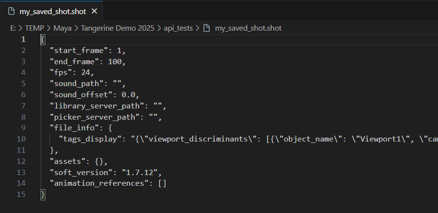
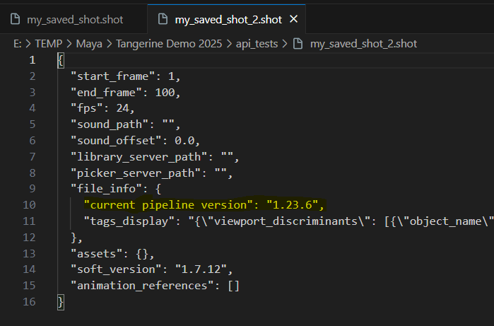
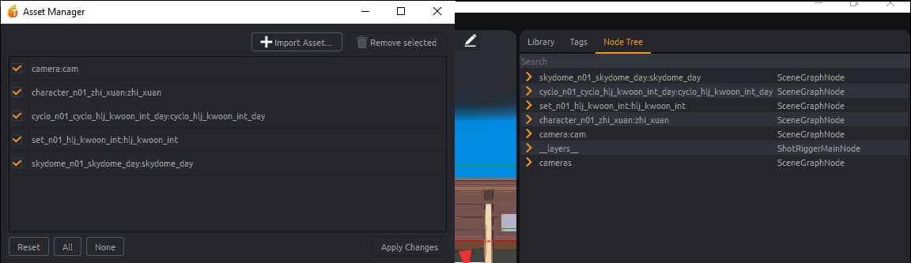

import Tabs from '@theme/Tabs';
import TabItem from '@theme/TabItem';

# Document

A document is the object representing a '.shot' file in Tangerine application.
A document has several attributes. Main ones are :
    `start_frame`, `end_frame`, `file_path`, `fps`, `sound_path`, `sound_offset`

Every nodes references in a document will be under the `root` node.

Any asset node loaded in the document will have a top-node under `root` and all it's hierarchy under.
The top node of a reference is renamed using a namespace if needed.

## Files operations

### Open document

<Tabs>
  <TabItem value="Python Code GUI" label="Python Code Tangerine GUI" default>
```python
# choose the references loading mode
from PySide2.QtWidgets import QApplication
from tang_core.asset.asset_load_mode import AssetLoadMode

TANG_LOAD_MODES = {
    "Load All": AssetLoadMode.ALL,
    "Load None": AssetLoadMode.NONE,
    "Load Default": AssetLoadMode.SAVED,
}

filePath = "[file_path]" # shot file

# get tangerine application instance
app = QApplication.instance()

# for this example we choose to load every reference
tangLoadMode = AssetLoadMode.ALL
# UI mode : specify to Tangerine we load shot file, so we have progression bar and relatives infos in tang
app.main_window.import_shot_files([filePath], load_mode=tangLoadMode)
```
  </TabItem>
  <TabItem value="Python Code batch" label="Python Code Tangerine batch" default>
In this mode, no api.main_window is available. Use following code to load your shot.

```python
from tang_core.document.shot import Shot
from tang_core.document.get_document import get_document

filePath = "[../../my_document_file_path.shot]"

document = get_document()
Shot.import_shot_files([filePath], document)
```
  </TabItem>
  <TabItem value="Package sample" label="Package sample">

```python
from PySide2.QtWidgets import QApplication
from tang_core.asset.asset_load_mode import AssetLoadMode

DEMO_FOLDER_PATH = "E:/TEMP/Tangerine/Tangerine Demo 2025/"

# choose the references loading mode
TANG_LOAD_MODES = {
    "Load All": AssetLoadMode.ALL,
    "Load None": AssetLoadMode.NONE,
    "Load Default": AssetLoadMode.SAVED,
}

filePath = DEMO_FOLDER_PATH + "/jade/jad_anim_217_001.shot" # shot file

# get tangerine application instance
app = QApplication.instance()

# for this example we choose to load every reference
tangLoadMode = AssetLoadMode.ALL
# UI mode : specify to Tangerine we load shot file, so we have progression bar and relatives infos in Tangerine
app.main_window.import_shot_files([filePath], load_mode=tangLoadMode)
```
  </TabItem>
</Tabs>

### Create new document
<Tabs>
  <TabItem value="Python Code GUI" label="Python Code Tangerine GUI" default>
    ```python
    from tang_gui.get_tang_window import get_tang_window

    # defining start and end frames of your shot
    startFrame = 1
    endFrame = 100
    fps = 24

    get_tang_window().do_new_document(self, start_frame=startFrame, end_frame=endFrame, fps=fps):
    ```
  </TabItem>
  <TabItem value="Python Code Batch" label="Python Code Tangerine Batch" default>
    ```python
    from tang_core.asset.asset_load_mode import AssetLoadMode
    from tang_core.document.get_document import get_document

    # defining start and end frames of your shot
    startFrame = 1
    endFrame = 100
    fps = 24

    # creating a document
    document = get_document()
    document.init_new(start_frame=startFrame, end_frame=endFrame, fps=fps)
    ```
  </TabItem>
</Tabs>

### Save document

<Tabs>
  <TabItem value="Python Code" label="Python Code" default>
```python
from tang_core.document.shot import Shot
from tang_core.document.get_document import get_document

filePath = "[file_path]" # shot file

document = get_document()
Shot.export_shot_file(filePath, document)
```
  </TabItem>
  <TabItem value="Package sample" label="Package sample">
```python
from tang_core.document.shot import Shot
from tang_core.document.get_document import get_document

DEMO_FOLDER_PATH = "E:/TEMP/Tangerine/Tangerine Demo 2025/"
filePath = DEMO_FOLDER_PATH + "/api_samples/my_saved_shot_2.shot"

document = get_document()
Shot.export_shot_file(filePath, document)
```
As a result, a .shot file is created

  </TabItem>
</Tabs>


### Add custom document data
Custom data can be added to document using file infos as following.

<Tabs>
  <TabItem value="Python Code" label="Python Code" default>
```python
from tang_core.document.get_document import get_document

name = "[variable_name]" # name of the value you want to store
text = "[you_text]"

# adding a fileinfo of string type
doc = get_document()
doc.set_file_info(name, text)

# getting the value in opened tangerine
fileinfo = doc.get_file_info(name, default=None)
```
  </TabItem>
  <TabItem value="Package sample" label="Package sample">
```python
from tang_core.document.get_document import get_document
# name of the value you want to store
name = "current pipeline version"
text = "1.23.6"

# adding a fileinfo of string type
doc = get_document()
doc.set_file_info(name, text)

# getting the value in opened tangerine
fileinfo = doc.get_file_info(name, default=None)
```
You can save again your file to see the added attribute in ascii.

  </TabItem>
</Tabs>

## References
@seb @max a little explanation to add here

### List references

<Tabs>
  <TabItem value="Python Code" label="Python Code" default>
```python

from tang_core.asset.asset import Asset
from tang_core.document.get_document import get_document

def getRootNodes(includeUnloaded=False, asDict=False, assetType=False):
        """
        Return asset nodes.

        :param includeUnloaded: Include assets that are not currently loaded.
        :type includeUnloaded: bool, defaults to False.
        :param asDict: Format return as dict{name: node}.
        :type asDict: bool, defaults to False.
        :param assetType: Include only nodes of type SceneGraphNode.
        :type assetType: bool, defaults to False.
        :rtype: list[node] or dict{name: node} (see :param asDict:).
        """
        document = get_document()

        if assetType:
            nodes = list(Asset.loaded_assets(document))

            if includeUnloaded:
                nodes += list(Asset.unloaded_assets(document))
        else:
            assert not includeUnloaded, "Only Asset nodes can be unloaded."

            nodes = document.root().get_children()

        if asDict:
            return {node.get_name(): node for node in nodes}

        return nodes
```

  </TabItem>
  <TabItem value="Package sample" label="Package sample">

Let's try to get roots node in scene of demo package.
```python
from PySide2.QtWidgets import QApplication
from tang_core.asset.asset_load_mode import AssetLoadMode

DEMO_FOLDER_PATH = "E:/TEMP/Tangerine/Tangerine Demo 2025/"

# opening the scene in tangerine
filePath = DEMO_FOLDER_PATH + "/jade/jad_anim_217_001.shot" # shot file
app = QApplication.instance()
app.main_window.import_shot_files([filePath], load_mode=AssetLoadMode.ALL)

# getting root nodes
nodesDict = assetNodesDict = getRootNodes(asDict=True, assetType=True, includeUnloaded=True)
for nodeName in nodesDict.keys():
    print(nodeName)

```
As a result you will see in your Tangerine's console :
```
camera:cam
character_n01_zhi_xuan:zhi_xuan
character_n01_hui_lin:hui_lin
set_n01_hlj_kwoon_int:hlj_kwoon_int
cyclo_n01_cyclo_hlj_kwoon_int_day:cyclo_hlj_kwoon_int_day
skydome_n01_skydome_day:skydome_day
```
  </TabItem>
</Tabs>

### Add references

An asset file should always have one and only one topnode.
See below how to reference an asset into a shot.

```python
from tang_core.document.get_document import get_document

@modifier
doc = get_document()

filePath = "./capy_jb.tang"
namespace = "character"

# import_nodes(self, name, path, namespace='', modifier=None, asset_state=AssetState.LOADED)
doc.import_nodes(None, filePath, modifier=modifier, namespace=namespace)
@sixtine to test
```
### Remove references


<Tabs>
  <TabItem value="Python Code" label="Python Code" default>
```python
from tang_core.document.get_document import get_document
from tang_core.document.document import Undoable

document = get_document()
node = [root_node] # this is the root node that you want to remove

# use modifier to certify your scene modifications that impacts nodal will be managed properly
with document.modify("removing reference", undoable=Undoable.NO_AND_CLEAR_STACK) as modifier:

    document = get_document()

    # We delete pointers to the node
    nodeName = node.get_name()
    del node

    document.unload_asset_from_name(nodeName, modifier=modifier)
```
  </TabItem>
  <TabItem value="Package sample" label="Package sample">

```python
from PySide2.QtWidgets import QApplication
from tang_core.asset.asset_load_mode import AssetLoadMode
from tang_core.document.get_document import get_document
from tang_core.document.document import Undoable

DEMO_FOLDER_PATH = "E:/TEMP/Tangerine/Tangerine Demo 2025/"

# opening the scene in tangerine
filePath = DEMO_FOLDER_PATH + "/jade/jad_anim_217_001.shot" # shot file
app = QApplication.instance()
app.main_window.import_shot_files([filePath], load_mode=AssetLoadMode.ALL)

document = get_document()
node = document.root().find("character_n01_hui_lin:hui_lin") # only asset nodes can be removed.

with document.modify("removing reference", undoable=Undoable.NO_AND_CLEAR_STACK) as modifier:

    # We delete pointers to the node
    nodeName = node.get_name() # name of the top node of the asset
    print("Removing node %s" % nodeName)
    del node

    document.unload_asset_from_name(nodeName, modifier=modifier)
```
See the result in your node tree or in the asset manager.


  </TabItem>
</Tabs>

:::tip
It is necessary to remove any pointer to a node that you want to remove.
`del node`
:::

### Edit references path

<Tabs>
  <TabItem value="Python Code" label="Python Code" default>
```python
from tang_core.asset.asset_loader import AssetLoader
from tang_core.document.get_document import get_document

doc = get_document()

newfilePath = "[new_tang_file_path]" # path of Tangerine asset file you want to use
nodeName = node.get_name()

with document.modify("update reference path", undoable=Undoable.NO_AND_CLEAR_STACK) as modifier:
    del node
    AssetLoader.replace_asset(nodeName, newfilePath, modifier)

```
  </TabItem>
  <TabItem value="Package sample" label="Package sample">

```python
from tang_core.asset.asset_loader import AssetLoader
from tang_core.document.get_document import get_document

doc = get_document()

DEMO_FOLDER_PATH = "E:/TEMP/Tangerine/Tangerine Demo 2025/"
newfilePath = DEMO_FOLDER_PATH + "/Jade/Assets/jad_release-anim_zhi-xuan_v000.tang"

node = document.root().find("character_n01_hui_lin:hui_lin")
nodeName = node.get_name()

with document.modify("update reference path", undoable=Undoable.NO_AND_CLEAR_STACK) as modifier:
    del node
    AssetLoader.replace_asset(nodeName, newfilePath, modifier)
```
  </TabItem>
</Tabs>

### Rename reference node

<Tabs>
  <TabItem value="Python Code" label="Python Code" default>
```python
from tang_core.document.document import Undoable
from tang_core.document.get_document import get_document

doc = get_document()

# We want to rename node
nodeName = node.get_name() # node is the node you want to rename
newName = "[new_asset_name]"

with doc.modify("rename_%s_to_%s" % (nodeName, newName), undoable=Undoable.NO_AND_CLEAR_STACK) as modifier:
    modifier.rename_node(assetNodesDict[nodeName], newName)
```
  </TabItem>
  <TabItem value="Package sample" label="Package sample">

```python
from PySide2.QtWidgets import QApplication
from tang_core.asset.asset_load_mode import AssetLoadMode
from tang_core.document.get_document import get_document
from tang_core.document.document import Undoable

DEMO_FOLDER_PATH = "E:/TEMP/Tangerine/Tangerine Demo 2025/"

# opening the scene in tangerine
filePath = DEMO_FOLDER_PATH + "/jade/jad_anim_217_001.shot" # shot file
app = QApplication.instance()
app.main_window.import_shot_files([filePath], load_mode=AssetLoadMode.ALL)

document = get_document()

# We want to rename node
node = document.root().find("character_n01_hui_lin:hui_lin/geo")
nodeName = node.get_full_name() # node is the node you want to rename
newName = "geometry"

with document.modify("rename_%s_to_%s" % (nodeName, newName), undoable=Undoable.NO_AND_CLEAR_STACK) as modifier:
    modifier.rename_node(node, newName)

# Or if you want to change a namespace
node = document.root().find("character_n01_hui_lin:hui_lin")
nodeName = node.get_full_name() # node is the node you want to rename
newName = "character_kung_fu:hui_lin"

with document.modify("rename_%s_to_%s" % (nodeName, newName), undoable=Undoable.NO_AND_CLEAR_STACK) as modifier:
    modifier.rename_node(node, newName)

```
  </TabItem>
</Tabs>
