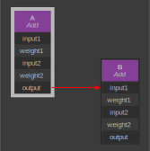
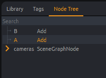

import Tabs from '@theme/Tabs';
import TabItem from '@theme/TabItem';

# Nodes

**Nodes** are at the heart of Tangerine. A node reflects a function with inputs and outputs.
For example, the Add node takes two input float numbers ("input1 and "input2") and has one output. The output float value is evaluated, depending on the values in input1 and input2. Both inputs and outputs are named **Plugs** (or attributes) and can be set either with raw values or be connected to other plugs of other nodes.

In the following example, we just have two Add node - A and B - and we connect the output of A to the first input of B. This example is equivalent to: (1.0+2.0)+(-3.0) = 0.0

Copy/paste this in the command Line window:
```python
from meta_nodal_py import Add

r = document.root()

A = Add(r, 'A')
B = Add(r, 'B')

A.input1.set_value(1.0)
A.input2.set_value(2.0)

print(A.output.get_value())  # prints 3.0

B.input1.connect(A.output)
B.input2.set_value(-3.0)

print(B.output.get_value())  # prints 0.0
```

Imagine now dozens, hundreds and thousands of such nodes interconnected in a giant graph. This is how rigs are made, and this defines the **Node Graph** of Tangerine. Of course, here the Add node is very simple, it just computes the addition of its float input values. But values can be Meshes, 3D Vertices, Matrices, Splines, and node functions can be more complex than just an addition: we have nodes for IK, Skinning and Lattice deformers, etc. Tangerine offers all the nodes needed to define a complete 3D rig.

:::warning
You can't create a cycle in Tangerine: the output of a node cannot be connected to the inputs of its dependencies. It means in the example above, you cannot do: `A.input1.connect(B.output)`. Tou can check that with `A.input1.can_connect(B.output)` which returns `False` here.
:::

## Visualizing the Node Graph

As Tangerine is not a rigging tool (see Mikan for this), it does not have any Node Editor GUI. That said, Tangerine still provides a way to visualize the node graph by the mean of [GraphViz](https://graphviz.org/download/), a free tool that generates an image from a nodal graph. So first download and install this tool, add the "bin" GraphViz path to your PATH environment variable (usually `C:\Program Files\Graphviz\bin`), and copy/paste this to your Command Line window:

```python
from tang_gui.get_tang_window import get_tang_window
from tang_gui.widgets.nodal_viz_widget import NodalVizWidget
with document.modify("select nodes") as modifier:
    modifier.select_nodes([A])
NodalVizWidget(get_tang_window()).show()
```
A "Nodal Viz" window then appears, let all option with default values, and just click on the "Render" button. Your default system browser should appear showing a svg file generated in your TEMP directory:

<div align="center"></div>

## The Node Hierarchy

You've seen in the previous example that to create a node we not only need its class (Add) and its name ('A' or 'B') but also its parent. In this example we used the root node of Tangerine (see the `r` variable) as the parent of both A and B. We could have used A for the parent of B, and the result of the B output wouldn't have changed. So why are we parenting all nodes in a tree-like structure (we often call this structure the Scene Graph)? We do that because:
- we want to gather functional groups of nodes altogether (imagine a math formula with many math nodes)
- we want to gather groups of nodes per asset (we may have many characters and props in a shot, so it's easier to track them if their nodes are clearly separated)
- the parenting has a real meaning for very special node types: DisplayNodes and SceneGraphNodes.

:::info
The only node type that cannot be parented is the RootNode type, there is only one RootNode in a Tangerine node hierarchy and it's at the very top level. You can access the RootNode of Tangerine via the document, as we have seen in the main function of the Document class in the previous chapter: `root_node = document.root()`
:::

:::warning
You can't add two nodes with the same name under the same parent, or you will get a python exception
:::

### Visualizing the Node Hierarchy

The Node Tree window show the Node hierarchy of Tangerine. We don't recommend that animators use it, but only riggers and TDs, for performance reasons (this window is updated when the hierarchy changes, and it can slow down the work of animators). In the Windows menu, select Node Tree, and see on the upper right corner of Tangerine the new "Node Tree" tab, click on it and you should see this:

<div align="center"></div>

You see the A and B nodes from the previous example, and the "cameras" SceneGraphNode. If you expand this "cameras" node you will see all default cameras in Tangerine (the Persp camera and all orthographic cameras: Top, Right, Back, etc).

The item selection of the Tree View widget in this window is synchronized with the node selection in the viewports. So, again, for fast operations of Animators, it's better to hide the Node Tree from them.

Finally, note that the RootNode is not visible in the Node Tree window, in fact it's "above" it: this window shows directly the children of the RootNode.

### Node Hierarchy Functions

- Use `name = node.get_name()` to get the node name
- Use `parent = node.get_parent()` to get the parent of a node
- Use `node.set_parent(other_parent)` to change the parent of a node (SceneGraphNodes have the special `reparent` function, we see that later)
- Use `child = node.find(child_name)` to find a direct child of node with a given name, this function is *not* recursive
- Use `descendant = node.find_first(name)` to find the first descendant with a given name recursively (caution: it's slow!)
- You can get all the children of a node into a python list with `children = node.get_children()` while the best way to iterate recursively in a node hierarchy is by using a dedicated iterator with `node.node_iterator()`:
```python
for iterator in node.node_iterator():
    node = iterator.node
    print(node.get_name())  # prints the children name, as well as the name of the children of children, etc
```
- to *unparent* a node use `remove_from_parent()`, please understand it will *delete* the node if it's not referenced anywhere else in your python code:
```python
node.remove_from_parent()
del node  # actually delete the node
```
```python
node_list = [node]
node.remove_from_parent()
del node  # do not remove the node due to python reference in node_list
node_list.clear()  # no more python reference to node so it's actually deleted now!
```
Please see the full list of functions in the API Reference.

:::warning
Prefer to use the "modifier version" of these functions, see the next page on Modifiers.
:::

### Hierarchy-dependent behaviors

Now, let's see the two special Node types which behave diffently depending on where they are placed in the Node Hierarchy.

#### DisplayNodes

A DisplayNode has just two boolean inputs - show and parent_visible - and one boolean output: visible.

The visible plug value is computed as the boolean AND operator of both of the inputs. That means a DisplayNode can actually be seen in the shot if:
- its show plug value is True

AND:

- all of its DisplayNode ancestors (its parent, the parent of its parent, etc.) have a show value equal to True
 
Since the show value can be animated over time, that's how the visibility of part of the rig is controlled in the shot.
 
#### SceneGraphNodes

A SceneGraphNode has a similar mechanism with transform matrices: it has two input matrix plugs - transform and parent_world_transform - and one matrix output: world_transform.

The world_transform plug value is computed as the matrix multiplication of both the inputs: transform * parent_world_transform.

Since the transform plug can be rigged (connected to other nodes), we can animate it over time. That's how positions and rotations are animated in a rig.

:::info
- The SceneGraphNode class inherits from the DisplayNode class, so a SceneGraphNode is also a DisplayNode.
- The Joint class inherits from SceneGraphNode, it adds the ability to ignore the scale component of the parent joints ("scale compensate") and we rig its transform in a way we can alter statically its orientation ("joint orient")
- The SceneGraphNode has a special function: `scene_graph_node.reparent(new_parent)`. If new_parent is a SceneGraphNode too, then the transform of scene_graph_node is adjusted so that its world_transform remains unchanged.
:::

### Node Full Names

Each node has a name and a parent which, in turn, has a name and a parent, etc. So if we use the separator `/` we can compute the *path* of the node from the root of the node hierarchy. We call it the node full name, and you can get it with the `node.get_full_name()` function:

```python
from meta_nodal_py import Node

r = document.root()

A = Node(r, 'A')
B = Node(A, 'B')
C = Node(B, 'C')

print(C.get_full_name())  # prints /Root/A/B/C

r.get_sub_path(C.get_full_name())  # prints /A/B/C
```

It can be useful to know if two different nodes are the same or not, because two different nodes can have the same name while they cannot have the same full_name.

:::tip
Note how `ancestor.get_sub_path(descendant)` can be used to get only a portion of the path.
:::

### Asset Nodes

Asset Nodes have a special position in the Node Hierarchy: they have to be "top nodes", ie nodes just below the RootNode. In addition to being a top node, an Asset Node should have some special plugs:
- some plugs prefixed with `gem_` and these plugs are added by Mikan in the asset build process
- the "asset_state" plug which hold the information about the loading state of this asset (ie loaded or unloaded)

You can check in the Node Tree after you import JB the Capy in Tangerine (see "Hello Tangerine"), you can see it's just a SceneGraphNode. The special plugs above have been added as *dynamic* plugs, which are documented hereafter.

When you unload an asset in the Asset Manager window of Tangerine (in the File menu), the Asset Node remains in place but all of its children are removed (until you reload the asset, then the children are restored as well as all data related to the shot: animations, shot constraints, etc.).

Note that Asset Nodes and its children are not saved in `*.shot` files but in assets, ie `*.tang` files. More generally a shot file does not save any nodes except animations and rigs specific to the shot.

:::warning
All top nodes are not asset nodes, not only the "cameras" node (which is the parent of all default cameras in Tangerine) but also the parent nodes of layers, dummies, shot constraints and shot clusters (respectively: "\_\_layers\_\_", "\_\_dummies\_\_", "\_\_shot_constraints\_\_" and "\_\_shot_deformers\_\_").
:::

Here is how to check if a top node is really an asset and if it's actually loaded:
```python
from tang_core.asset.asset import Asset

for node in document.root().get_children():
    if Asset.is_asset(node.get_name()) and Asset.is_asset_loaded(node):
        print("the following asset is loaded: " + node.get_name())
```

:::info
**The Mikan Link**

Mikan is installed with Tangerine, because that's not only a rigging framework to build assets but also a set of interactive features that you can call from within Tangerine: flip or mirror poses and anims, go back to bind poses, switch IK/FK, etc. You can see all of them in the contextual menu of controllers, see the User Manual to know more about these Mikan features available in Tangerine. But in fact, the relationship between Mikan and Tangerine goes beyond this: **Tangerine itself is built on Mikan knowledge of what an asset is**. Mikan is reponsible to list controller in assets, and that's how Tangerine knows what to save in a shot file. This communication is made possible by the Mikan Link at the Tangerine startup: some callbacks are made available from Mikan so that it can answers "questions" from Tangerine tools and scripts, and the good news is that you can take advantage of this communication too in your own scripts:
```python
from tang_core.callbacks import Callbacks  # Callbacks are implemented in Mikan

# ask Mikan for the asset node of JB the Capy (see Hello Tangerine to load it first):
asset_node = Callbacks().get_asset_node("character1:capy_jb")

# ask Mikan for the world controller of this asset:
world_controller = Callbacks().find_controller_in_asset(asset_node, "world")

world_controller.show.set_value(True)  # use this controller

# ask Mikan all controllers to print their name:
for ctrl in Callbacks().get_all_controllers_in_asset():
    print(ctrl.get_name())
```
Note that `Asset.is_asset(node_name)` we saw previously just calls Mikan too internally. The Tangerine Asset class just handle loading states of assets, Mikan classes do the rest.
:::

## The Node Classes

As we've seen just above the notion of inheritance between node classes: a SceneGraphNode will have all the plugs (attributes) of a DisplayNode. At the very top of the class hierarchy, there is the Node class, which is the base class of all node classes. A node of class Node hast just one plug: the name of the node. The DisplayNode class inherits from it, and thus has a name plug too. The SceneGraphNode class inherits from the DisplayNode class and thus has a name plug as well as all other plugs defined in the DisplayNode class. It works exactly like Python classes, except that the implementation of all these classes are in the C++ module meta_nodal_py.pyd. This module provides Python bindings to allow Python to access the class attributes and inheritance infos just like if it has been made directly in Python.

:::info
This is one major difference with other legacy 3D software: the Tangerine kernel is made in C++ (with Python bindings) and all the GUI is in pure Python code!
:::

This is an excerpt of the Tangerine class hierarchy, with just the nodes we have seen so far:

```
                Node
                 |
    +------------+----------+
    |            |          |
   Add        RootNode  DisplayNode
                            |
                       SceneGraphNode
                            |
                          Joint
```

All the classes are documented in the API Reference. We just give a quick overview below of the different classes.

:::warning
- Be careful not to confuse the class hierarchy, which is a tree hierarchy of node classes (the top is the Node class), and the node hierarchy, which is a tree hierarchy of node instances (the top is always the RootNode).
- there is no "Asset Node" class above because an Asset Node is just a SceneGraphNode with some "custom attributes" (ie "dynamic plugs" in Tangerine vocabulary).
:::

### Overview of Node Classes

We can gather nodes in different category to have an overview:

#### Math nodes

The simplest nodes are nodes that works on simple or vector values to make math operations (see the Add node at the top of this page, which just adds two float values and output the result):
- Float values: Add, Sub, Mult, Div, Abs, Acos, Asin, Atan, Blend, Ceil, Floor, ClampFloat, Condition, Cos, Sin, Tan, IsEqual, IsGreater, IsGreaterOrEqual, Pow, RemapFloat, Noise
- Boolean values: And, Or, Xor, Not
- Interger values: Modulo
- Vector values: Dot, Cross, Normalize, ScaleV3f, BlendV3f, MultDir, Length, Distance
- Matrix values: MultM44f, InverseM44f, ScalarM44f, BlendTransformsNode, BlendWeightedTransforms, RigidM44f
- Quaternion values: MultQuatf, InverseQuatf, NormalizeQuatf, BlendQuatf, ConjugateQuatf, LengthQuatf, MultQuatf, ScaleQuatf

#### Conversion Nodes

- Simple values and vectors: FloatToBool, BoolToFloat, BoolToInt, FloatToColor4f, FloatToEuler, FloatToInt, FloatToQuatf, FloatToV2f, FloatToV3f, EulerToFloat, IntToBool, IntToFloat, V3fToFloat
- Matrices: IJKToTransform, JointTransformToSRT, SRTToJointTransform, SRTToTransformNode, TransformToSRTNode
- Quaternions: AxisAngleToQuatf, EulerToQuatf, M44fToQuatf, QuatfToAxisAngle, QuatfToFloat, QuatfToM44f

#### 3D nodes and their Reader Nodes

- 3D nodes: Geometry, SplineCurve, Camera, SceneGraphNode, Joint
- Reader Nodes: AnimatedGeometryReader, AnimatedTransformReader, GeometryReader, SplineCurveReader, TransformReader

#### Deformer Nodes

- Common deformers: BlendShape, Skin, DualQuatSkin
- Non-linear deformers: Bend, Cluster, Flare, Freeform, ShrinkWrap, Sine, Twist, Wave, Wire, Squash

#### Constraints Nodes

We have two kind of constraints nodes:

- those used in asset rigs: ParentConstrain, OrientConstrain, PointConstrain, AimConstrain, TwistConstrain, ScaleConstrain
- those used for shot constraints (they have a 't' at the end): ParentConstraint, OrientConstraint, PointConstraint

#### IK and Snap Nodes

Closest, IK, PointOnSplineCurve, SplineIK

#### Nodes for Dynamics

Accumulate, PreviousV3f, Body, CurrentFrame, DeltaV3f

#### Animation Nodes

- Driven Keys for riggers: DrivenFloat, DrivenBool, DrivenInt, DrivenString
- For Animated values (created by animators): AnimFloat, AnimBool, AnimInt, AnimString

## Plugs

Plug is the Tangerine name for "attribute". A node can have many plugs (inputs and outputs), and you may call input_plug.set_value(value) or input_plug.connect(other_plug) when you build assets.
If you write a custom interactive tool for animators where you want to support undo/redo, you should not use directly use those functions but a Modifier (see next chapter, and see how we did that in Hello Tangerine).

:::warning
You cannot call connect or set_value on an output plug!
:::

### Main Functions of Plugs

- Get the node owner of a plug by calling: `node = plug.get_node()`
- Get its name with `name = plug.get_name()`
- Get the type of the value it hold: `type_name = plug.get_type_name()` returns 'float', 'int', 'bool', etc.
- Get its value with:
	- `value = plug.get_value()`, this gets the first value of the cache
	- `value_at_frame_10 = plug.get_value(10)`
- Set its value with:
	- if it's an input constant plug: `plug.set_value(5.0)` (float plug)
	- if the input plug is animated, we have tho use this helper function:
```python
from tang_core.anim import is_keyable, set_animated_plug_value

set_animated_plug_value(plug,
                        5.0, # value
                        10,  # frame
                        force_key=True,
                        modifier=modifier)  # modifier cannot be None
```
- Use `plug1.connect(plug2)` to connect both plugs and `plug1.disconnect(restore_default=True)` to disconnect them.

You can call `node.get_plugs()` to get the list of all the plugs of a given node.

Please see the Reference API for the full list of functions.

:::warning
Prefer to use the "modifier version" of these functions, see the next page on Modifiers.
:::

### Plug Value Types

All the node classes above use Plugs with various Value types. Here are most of them:

- Simples values: float, int, bool, string
- Vectors, Matrices, etc: V2f, V3f, V4f, M33f, M44f, Color3f, Color4f, Eulerf, Box2f, Box3f, Quatf, Line3f, Plane3f (they are all Imath bindings)
- 3D data: Mesh, Spline
- Key Curves: CurveFloat, CurveBool, CurveInt, CurveString

:::info
- Internal floats in Tangerine are 32 bits (C++ float type) even if Python "float" type is 64 bits (C++ double type).
- Internally we use different classes for Plugs depending on their value types but the APIs are exactly the same:
```python
from meta_nodal_py import Add
A = Add(document.root(), 'A')
print(A.name.__class__)  # prints <class 'meta_nodal_py.PlugString'>
print(A.input1.__class__)  # prints <class 'meta_nodal_py.PlugFloat'>

# same APIs on these classes...
str1 = A.name.get_name()
str2 = A.input1.get_name()

# ...but some functions cannot be mixed among different typenames:
A.name.connect(A.input1)  # error (python exception)! there is no point on connecting a string to a float
```
:::

### The Plugs view

We learnt above how to visualize the Node Graph and the Node Hierarchy, and there is another view that may be useful for developers and riggers (but not to animators), that's the "attribute editor" of Tangerine which we named the Plugs view. You can access it too via the Windows menu.

The Plugs view shows all the plugs values of the last node in the selection, if any. The purpose of this view is to inspect values and follow the connections with the contextual menu on the plugs to debug rigs and scripts. Values of plugs can be edited here and that's why it should not be used by animators because some values are stored neither in the shot file nor back in the the asset file (which is always read-only). So any edition in the Plugs view is temporary and will be lost when Tangerine is closed.

### Dynamic Plugs

Dynamic Plugs are the "custom attributes" of Tangerine. A developer can add dynamic plug to any node by calling `add_dynamic_plug` on the node:

```python
from meta_nodal_py import Node

r = document.root()

n = Node(r, 'my node')

p = n.add_dynamic_plug("custom", 1.0)
p.set_value(2.0)

n.custom.set_value(3.0)  # Python style attribute works too
```

Once a plug has been added like this, that's an input plug: you can call `set_value()` and `connect()`.

Dynamic plugs are included in the list returned by `node.get_plugs()`, with other common plugs, but you can list only dynamic plugs with `node.get_dynamic_plugs()`. 

### User Infos of Plugs

You may add your own user infos or meta-data on plugs. Indeed, each plug, dynamic or not, hold a dictionary of strings:

```python
from meta_nodal_py import Add

r = document.root()

A = Add(r, 'my node')

A.input1.set_user_info("my_entry_key", "my_data")
A.input1.set_user_info("age", "30")

for key, value in A.input1.get_all_user_infos().items():
    print(key + ": " + value)
```

Tangerine uses this mechanism to store important information in rigs. For example, a keyable plug has the entry `"keyable": "yes"` in the dictionnary. There is a `is_keyable()` helper function (it just checks in the user info dict), and here is how to use it:

```python
from tang_core.anim import is_keyable, set_animated_plug_value

# add animation on keyable plugs of the node selection
with document.modify("create anim curves") as modifier:
    for node in document.node_selection():
        for plug in node.get_plugs():
            if not is_keyable(plug):  # helper function to check if "keyable" is "yes" in plug user infos
                print("not keyable plug, skipping: " + plug.get_name())
            else:
                set_animated_plug_value(plug,
                                        plug.get_value(document.current_frame),
                                        frame=document.current_frame,
                                        force_key=True,
                                        modifier=modifier)
```

### Plug Size

Each plug can store multiple values, and it can be connected at different "indices". A "connection" in Tangerine is a pair of a plug and an index.
You can access to the different connections via the bracket operator, let's use the same example script from above (in Dynamic Plugs) with a size of 6:

```python
from meta_nodal_py import Node

r = document.root()

# node to illustrate calls to connect later:

n2 = Node(r, 'other node')
p2 = n2.add_dynamic_plug("foo", 1.0)
n2.add_dynamic_plug("bar", 1.0)

# node with a sized plug:

n = Node(r, 'my node')
p = n.add_dynamic_plug("custom", 1.0, 6) # default size is 1, here we set it to 6

p.set_value(2.0)  # default second paramter is the first index (0)
p.set_value(3.0, 1)  # we put another value at index 1

# we use brackets for other indices (2 to 5):

p[2].set_value(-4.0)  
p[3].connect(p2)

n.custom[4].set_value(3.0)  # Python style attribute works too
n.custom[5].connect(n2.bar)
```

:::info
Internally we use an intermediate classes called *connections* that wrap for each type the former plug and the index, but that doesn't change the way you use plugs, the API is the same on plugs and on connections:
```python
print(n2.bar.__class__)  # prints <class 'meta_nodal_py.PlugFloat'>
print(n.custom[5].__class__)  # prints <class 'meta_nodal_py.PlugFloat_connection'>
```
:::

### Plug Full Names

We have seen before how nodes can have a full name. Plugs also have one: a plug full name is the full name of its node with a point and the name of the plug. If the plug size is greater than one, brackets are used with the index.

From the previous example, add this line:
```python
print(n2.bar.get_full_name())  # prints /Root/other_node.bar
print(n.custom[5].get_full_name())  # prints /Root/my node.custom[5]
```
