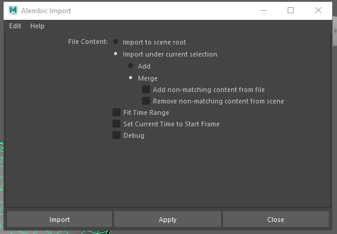
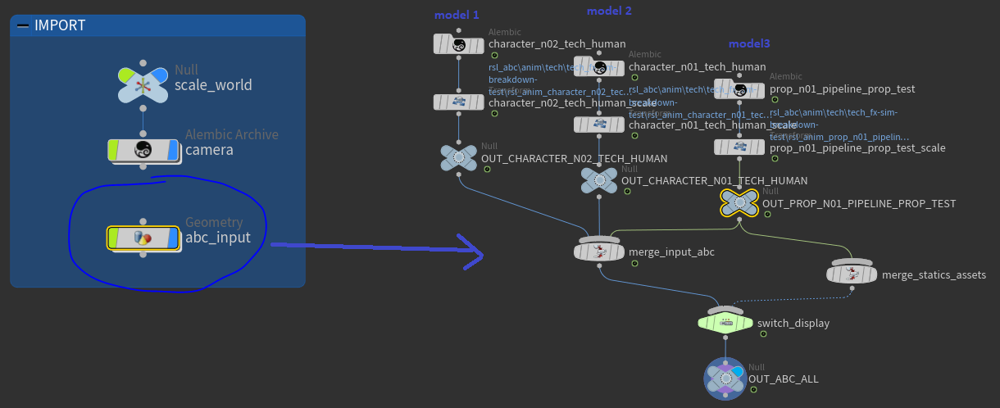
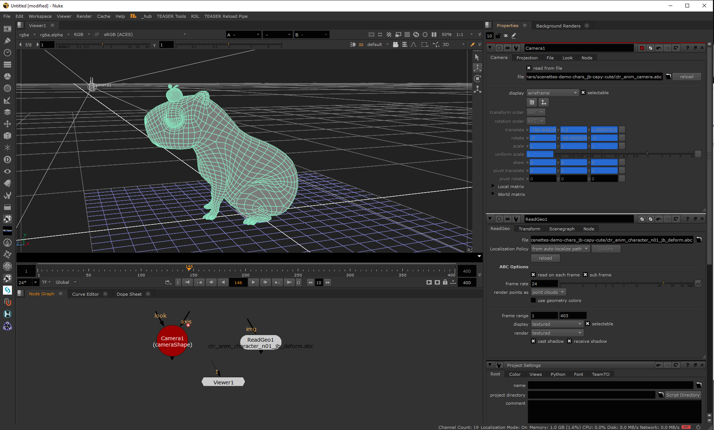
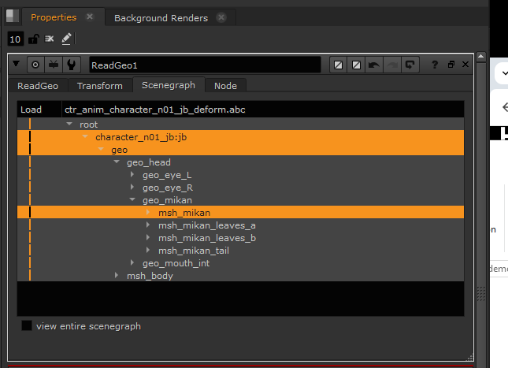

# Tangerine Outputs

Output formats of Tangerine are Alembic files and Usd file.

You will be able to load these output files in industry software.

## Alembic Files

```Alembic is an open computer graphics interchange framework. Alembic distills complex, animated scenes into a non-procedural, application-independent set of baked geometric results. This ‘distillation’ of scenes into baked geometry is exactly analogous to the distillation of lighting and rendering scenes into rendered image data.

Alembic is focused on efficiently storing the computed results of complex procedural geometric constructions. It is very specifically not concerned with storing the complex dependency graph of procedural tools used to create the computed results. For example, Alembic will efficiently store the animated vertex positions and animated transforms that result from an arbitrarily complex animation and simulation process which could involve enveloping, corrective shapes, volume-preserving simulations, cloth and flesh simulations, and so on. Alembic will not attempt to store a representation of the network of computations (rigs, basically) which are required to produce the final, animated vertex positions and animated transforms.
```

Alembic being an Open source technology, this output standard makes an efficient bridge from Tangerine to other industry software.

In the Alembic file, you will find two types animation datas :
- Animation curves on transform objects
- Baked Animation of deformed meshs

### Maya import

The AlembicImport plugin will allow you to load your alembic into Maya.
Maya can be used for lighting, rendering in the next steps of your pipeline chain for example.

Find the UI menu to import it in `Cache` > `Alembic Cache` > `Alembic Import (Options)`.



You have several possibilities to import your Alembic.

# Several option are available

<details>
  <summary>Import to scene root</summary>

  Import to scene root will create :
  - An Alembic node
  - The full hierarchy of nodescontained in alembic file, in Maya format (transform, meshs, locators, ...)

  Nodes of this hierarchy that have animation data (keys, baked geometry) will be connected to alembic node.

  ```mel
  AbcImport "E:/TEMP/tangerine/Tangerine Demo 2025/api_tests/tangerine_modeling.abc"
  ```
</details>
<details>
  <summary>Import to current selection</summary>
  <details>
    <summary>Add option</summary>

    Import to current selection with add option create :
    - An Alembic node
    - Only nodes that does not exists in actual hierarchy but exists in .abc file

    Animated nodes of the hierarchy will be linked to the Alembic node created

  </details>
  <details>
    <summary>Merge option</summary>

    Import to current selection with merge option create :
    - An Alembic node
    - The full hierarchy of nodes contained in alembic file, in Maya format (transform, meshs, locators, ...)

    ```mel
    AbcImport -mode import -connect "jb" "E:/TEMP/tangerine/Tangerine Demo 2025/api_tests/tangerine_modeling.abc"
    ```
  </details>

</details>

With this method, the algorithm of AlembicImport works like a tree. As soon as a change of hierarchy is detected in a branch, algorithm will stop to try to merge this branch and go back on the tree.


:::info

If your alembic file contains only static values (no animation, different positions in several frames), you won't see any Alembic node connected in the maya scene.

Only the linked nodes, the animated one, will be updated automatically if Alembic file changes.

To ensure all the positions and values are up do date, even set values not animated, please automate the merge of the alembic at every opening of your maya file.
:::

:::warning

The AlembicImport plugin has some limitations such as :
- Merging on another node than the selected one if there is namespaces and the top node name is not unique in maya scene
- Not connecting a plug to alembic node if this plug is already connected to another node, even if the connection is an input connection.
- Not Merging curves that have the same deformation on every frame (no animation)
- Some more.

We have several workarounds available. Please contact us if needed.
:::

### Houdini import

Houdini works with [alembic nodes](https://www.sidefx.com/docs/houdini/io/alembic.html). You will be able to load aembic files exported from Tangerine and add physical dynamic, effects, and so one.

Here is an example of merging animation into a houdini shot file.


:::info
There is a factor 100 scale from Tangerine to Houdini.
Use a scale node to find the scale expected after importing your alembic node.
:::

#### import alembic with python
```python

# set load mode 0: Shapes only, 1: Shapes and TRansforms, 2: Transforms only.
import hou
resize = parentNode.createNode("xform", node_name="resize")
setsize = resize.parm("scale")
setsize.set(10)

parentNode = hou.node(parentNodePath)
  newNode = parentNode.createNode(node_type_name=newNodeType, node_name=newNodeName)
  for attrName, attrValue in six.iteritems(kwargs):
      newNode.parm(attrName).set(attrValue)
  return newNode

abcNode.parm("abcxform").set(abcxform)

abcNode = soft.createNode(
                parentNodePath, "alembic", namespace, fileName=os.path.join(abcAnimationFolder, abcFilename)
            )

# set load mode 0: Shapes only, 1: Shapes and TRansforms, 2: Transforms only.
abcNode.parm("abcxform").set(abcxform)

transform = soft.createNode(parentNodePath, "xform", namespace + "_scale")
transform.parm("scale").setExpression('ch("../../scale_world/scale")')

transform.parm("tx").setExpression('ch("../../offset_world/tx")')
transform.parm("ty").setExpression('ch("../../offset_world/ty")')
transform.parm("tz").setExpression('ch("../../offset_world/tz")')
transform.parm("rx").setExpression('ch("../../offset_world/rx")')
transform.parm("ry").setExpression('ch("../../offset_world/ry")')
transform.parm("rz").setExpression('ch("../../offset_world/rz")')
transform.parm("xOrd").set(3)

parentNode.layoutChildren()

# set camera near plane scale factor
cameraShape = hou.node("/obj/camera/.../cameraShape/")
newNearClipExpression = cameraShape.parm("near").expression() + ' * ch("/obj/scale_world/scale")'
cameraShape.parm("near").setExpression(newNearClipExpression)
```
### Nuke import

Nuke is used for compositing. Nuke has 3D objects that you can use in your compositing workflow such as [Camera](https://learn.foundry.com/nuke/content/comp_environment/3d_compositing/importing_alembic_cameras.html) and [transofrms](https://learn.foundry.com/nuke/content/comp_environment/3d_compositing/importing_alembic_transforms.html).

To load a camera, use "Camera" (Camera 3D) type node.
To load a hierarchy of transforms, use "ReadGeo" type node.


:::tip
If your compositor uses selection in alembic hierachy, use following code to save it before to refresh any node.


```
import nuke
selectionDict = {}
abcNode = nuke.toNode("ReadGeo1")
abcItems = node["scene_view"].getSelectedItems()
selectionDict[node] = abcItems
```
:::

### Blender

Blender is used for lighting, rendering and more.
You can load alembics from Tangerine to [Blender](https://docs.blender.org/manual/en/latest/files/import_export/alembic.html#importing-alembic-files).
