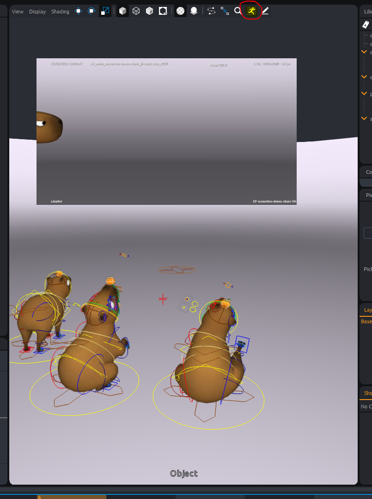

import Tabs from '@theme/Tabs';
import TabItem from '@theme/TabItem';

# Image plane

## animation references

A tool is available for animators to see in their camera image or image sequences references.
This tool is called "animation reference" and can be pre-configured in the pipeline as following.

```python
from tang_core.document.get_document import get_document

document = get_document()
imgage_path = "E:/TEMP/tangerine/Tangerine Demo 2025/api_samples/image_plane_sequence/anim_reference_image_plane.001.jpg"

ref = document.animation_references.register(imgage_path)
ref.label = "animatic"
```
Animators will then be able to chose this path when clicking on the "animation reference" button in a viewport. They should right clic to select the path when needed.


## Image plane on camera

If you need to create a specific image plane in your shot, you can create the following nodes by script.
Adding it to your asset trough Mikan features would be the best practise but sometimes you only need the node in animation and want to keep your cameras `.tang` clean.

...sample to come...
