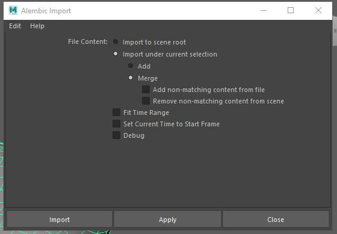
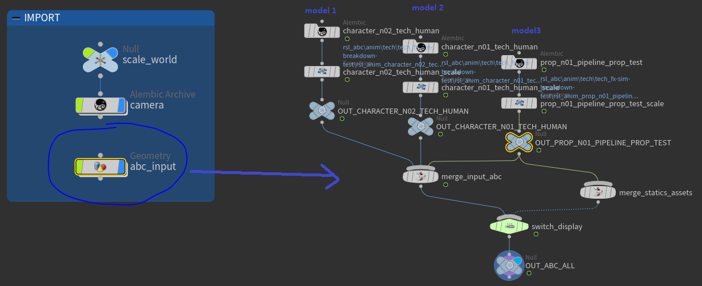
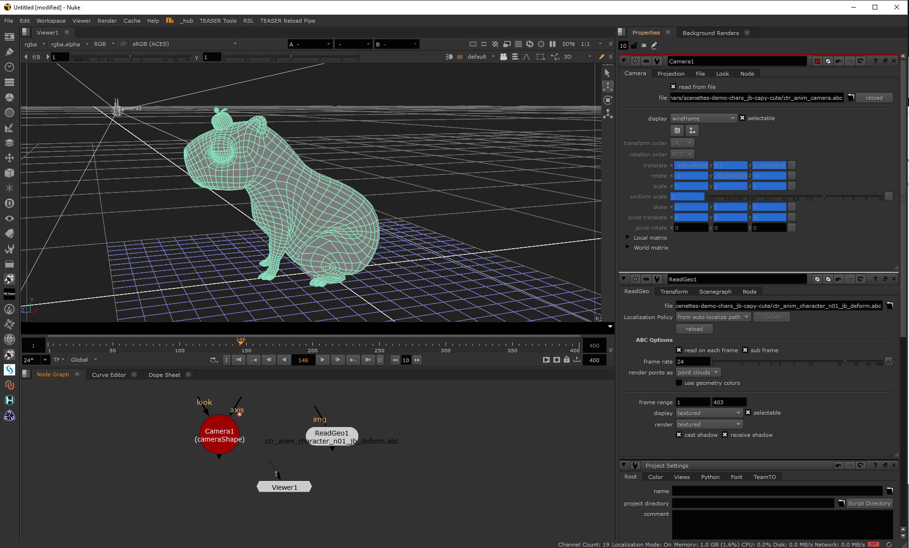

import Tabs from '@theme/Tabs';
import TabItem from '@theme/TabItem';

# Alembics Export

Tangerine outputs are Alembic files and USD files.

You can load these output files in standard industry software for further processing.

## Alembic Format

```Alembic is an open computer graphics interchange framework. Alembic distills complex, animated scenes into a non-procedural, application-independent set of baked geometric results. This ‘distillation’ of scenes into baked geometry is exactly analogous to the distillation of lighting and rendering scenes into rendered image data.

Alembic is focused on efficiently storing the computed results of complex procedural geometric constructions. It is very specifically not concerned with storing the complex dependency graph of procedural tools used to create the computed results. For example, Alembic will efficiently store the animated vertex positions and animated transforms that result from an arbitrarily complex animation and simulation process which could involve enveloping, corrective shapes, volume-preserving simulations, cloth and flesh simulations, and so on. Alembic will not attempt to store a representation of the network of computations (rigs, basically) which are required to produce the final, animated vertex positions and animated transforms.
```

Being open-source, Alembic provides an efficient bridge between Tangerine and other industry software.
In an Alembic file, you will typically find two types of animation data:

- Animation curves on transform objects
- Baked animation of deformed meshes

## Export animations to alembics
Tangerine has an alembic export available to wreite your animation result and load it in another 3D software.

(Tags)[#/sample_scripts/tags] can be used to a selector for bake action.
You can use them to optimize your Alembic data, ensuring that only the necessary elements are included for the post-production workflow.
See the use cases section for examples.

<Tabs>
  <TabItem value="Python Code" label="Python Code" default>

    ```python
    from tang_core.document.get_document import get_document
    from tang_core.bake import bake

    output_path = "YOUR_ABC_EXPORT_PATH.abc" # Path on the server where the alembic file will be saved. Folders should exists before export.

    document = get_document()

    nodes = [document.root().find("YOUR_ROOT_NODE_NAME")] # Tangerine nodes to export as alembic
    locators = False
    write_full_matrix = False
    subsamples = [-0.125, 0.125] # subsamples to export, [] for no subsamples export

    try:
      bake(
        filename=output_path,
        roots=nodes,
        exclude_tag=None, # find sample in advanced usecases to filter on nodes
        included_spline_tag=None, # find sample in advanced usecases to filter on nodes
        write_uv=True, # possible to disblae uv writing
        document=document,
        sub_samples=subsamples,
        write_full_matrix=write_full_matrix, # force exporting matrix values instead of each component values
        start_frame=document.start_frame,
        end_frame=document.end_frame,
        )
    except AttributeError:
        print(
            "Error exporting node %s, please check the hierarchy", str([node.get_name() for node in nodes])
        )
    ```
  </TabItem>
  <TabItem value="Package sample" label="Package sample">

    ```python
    from PySide2.QtWidgets import QApplication
    from tang_core.asset.asset_load_mode import AssetLoadMode
    from tang_core.document.get_document import get_document
    from tang_core.bake import bake
    from meta_nodal_py import SceneGraphNode, Geometry, SplineCurve
    #  or isinstance(node, SplineCurve) or isinstance(node, SplineCurve):
    demo_folder_path = "E:/TEMP/Tangerine/Tangerine Demo 2025/"
    file_path = demo_folder_path + "/api_samples/three_capy.shot" # shot file
    # opening the scene in tangerine
    app = QApplication.instance()
    app.main_window.import_shot_files([file_path], load_mode=AssetLoadMode.ALL)

    document = get_document()

    output_path = demo_folder_path + "/api_samples/my_exported_abc.abc" # Path on the server where the alembic file will be saved. Folders should exists before export.
    asset_node = document.root().find("character_n01_jb:jb") # asset node

    locators = False
    write_full_matrix = False
    subsamples = [-0.125, 0.125] # subsamples to export, [] for no subsamples export

    try:
      bake(
        filename=output_path,
        exclude_tag=None, # find sample in advanced usecases to filter on nodes
        included_spline_tag=None, # find sample in advanced usecases to filter on nodes
        roots=[asset_node],
        write_uv=True, # possible to disblae uv writing
        document=document,
        sub_samples=subsamples,
        write_full_matrix=write_full_matrix,
        start_frame=1,
        end_frame=document.end_frame,
      )
    except AttributeError:
        print(
            "Error exporting node %s, please check the hierarchy", str([node.get_name() for node in nodes])
        )
    ```
    Here we exported a full hierarchy as an Alembic file.
    See the use cases section for an example of an exported Alembic that can be used in your pipeline with tags.
  </TabItem>
</Tabs>

## Import alembic into industry softwares

### Maya import

The Alembic Import plugin allows you to load Alembic files into Maya.
Maya can then be used for lighting, rendering, and other steps in your pipeline.

Find the UI menu to import it in `Cache` > `Alembic Cache` > `Alembic Import (Options)`.



Several import options are available to control how Alembic data is loaded.

# Import Alembic to Maya options

<details>
  <summary>Import to scene root</summary>

  Importing to the scene root will create:
  - An Alembic node
  - The full hierarchy of nodes contained in the Alembic file, in Maya format (transforms, meshes, locators, etc.)

  Nodes in this hierarchy that have animation data (keys or baked geometry) will be connected to the Alembic node.

  ```mel
  AbcImport "E:/TEMP/tangerine/Tangerine Demo 2025/api_samples/tangerine_modeling.abc"
  ```
</details>
<details>
  <summary>Import to current selection</summary>
  <details>
    <summary>Add option</summary>

    Importing to the current selection with the "Add" option will create:
    - An Alembic node
    - Only the nodes that do not already exist in the current hierarchy but are present in the `.abc` file

    Animated nodes in this hierarchy will be linked to the created Alembic node.


  </details>
  <details>
    <summary>Merge option</summary>

    Importing to the current selection with the "Merge" option will create:
    - An Alembic node
    - The full hierarchy of nodes contained in the Alembic file, in Maya format (transforms, meshes, locators, etc.)

    ```mel
    AbcImport -mode import -connect "jb" "E:/TEMP/tangerine/Tangerine Demo 2025/api_samples/tangerine_modeling.abc"
    ```
  </details>

</details>

With this method, the AlembicImport algorithm works like a tree. As soon as a hierarchy change is detected in a branch, the algorithm stops attempting to merge that branch and moves back up the tree.

:::info
If your Alembic file contains only static values (no animation, i.e., the same positions across frames), you will not see any Alembic nodes connected in the Maya scene.

Only the linked nodes—those with animation—will be updated automatically if the Alembic file changes.

To ensure all positions and values are up to date, including non-animated set values, it is recommended to automate the Alembic merge each time you open your Maya file.
:::

:::warning
The AlembicImport plugin has some limitations, including:
- Merging on a different node than the selected one if namespaces exist and the top node name is not unique in the Maya scene.
- Not connecting a plug to the Alembic node if the plug is already connected to another node, even if the connection is an input.
- Not merging curves that have the same deformation on every frame (i.e., no animation).
- Other minor limitations.

We have several workarounds available. Please contact us if needed.
:::


### Houdini Import

Houdini works with [Alembic nodes](https://www.sidefx.com/docs/houdini/io/alembic.html).
You can load Alembic files exported from Tangerine and add physical dynamics, effects, and more.

Here is an example of merging animation into a Houdini shot file:


:::info
There is a 1:100 scale factor between Tangerine and Houdini.
Use a scale node to adjust the Alembic node to the correct scale after importing.
:::


#### import alembic with python
```python

# set load mode 0: Shapes only, 1: Shapes and TRansforms, 2: Transforms only.
import hou
resize = parent_node.createNode("xform", node_name="resize")

setsize = resize.parm("scale")
setsize.set(10)

parent_node = hou.node(parent_node_path)
new_node = parent_node.createNode(node_type_name=new_node_type, node_name=new_node_name)
for attr_name, attr_value in six.iteritems(kwargs):
  new_node.parm(attr_name).set(attr_value)
return new_node

abc_node.parm("abcxform").set(abcxform)

abc_node = soft.createNode(
  parent_node_path, "alembic", namespace, fileName=os.path.join(abc_animation_folder, abc_filename)
)

# set load mode 0: Shapes only, 1: Shapes and TRansforms, 2: Transforms only.
abc_node.parm("abcxform").set(abcxform)

transform = soft.createNode(parent_node_path, "xform", namespace + "_scale")
transform.parm("scale").setExpression('ch("../../scale_world/scale")')

transform.parm("tx").setExpression('ch("../../offset_world/tx")')
transform.parm("ty").setExpression('ch("../../offset_world/ty")')
transform.parm("tz").setExpression('ch("../../offset_world/tz")')
transform.parm("rx").setExpression('ch("../../offset_world/rx")')
transform.parm("ry").setExpression('ch("../../offset_world/ry")')
transform.parm("rz").setExpression('ch("../../offset_world/rz")')
transform.parm("xOrd").set(3)

parent_node.layoutChildren()

# set camera near plane scale factor
cameraShape = hou.node("/obj/camera/.../cameraShape/")
newNearClipExpression = cameraShape.parm("near").expression() + ' * ch("/obj/scale_world/scale")'
cameraShape.parm("near").setExpression(newNearClipExpression)
```
### Nuke Import

Nuke is used for compositing and supports 3D objects that you can integrate into your workflow, such as [Cameras](https://learn.foundry.com/nuke/content/comp_environment/3d_compositing/importing_alembic_cameras.html) and [Transforms](https://learn.foundry.com/nuke/content/comp_environment/3d_compositing/importing_alembic_transforms.html).

- To load a camera, use a **Camera** (Camera 3D) node.
- To load a hierarchy of transforms, use a **ReadGeo** node.



:::tip
If your compositing workflow relies on selecting objects in an Alembic hierarchy, use the following code to save the selection before refreshing any node.


```python
import nuke
selectionDict = {}
abcNode = nuke.toNode("ReadGeo1")
abcItems = node["scene_view"].getSelectedItems()
selectionDict[node] = abcItems
```
:::

### Blender

Blender is used for lighting, rendering, and other tasks.
You can import Alembic files exported from Tangerine into [Blender](https://docs.blender.org/manual/en/latest/files/import_export/alembic.html#importing-alembic-files).

...details to come...
