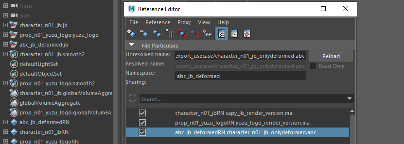
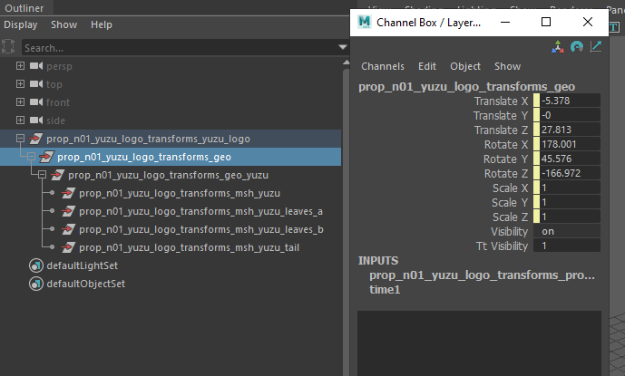
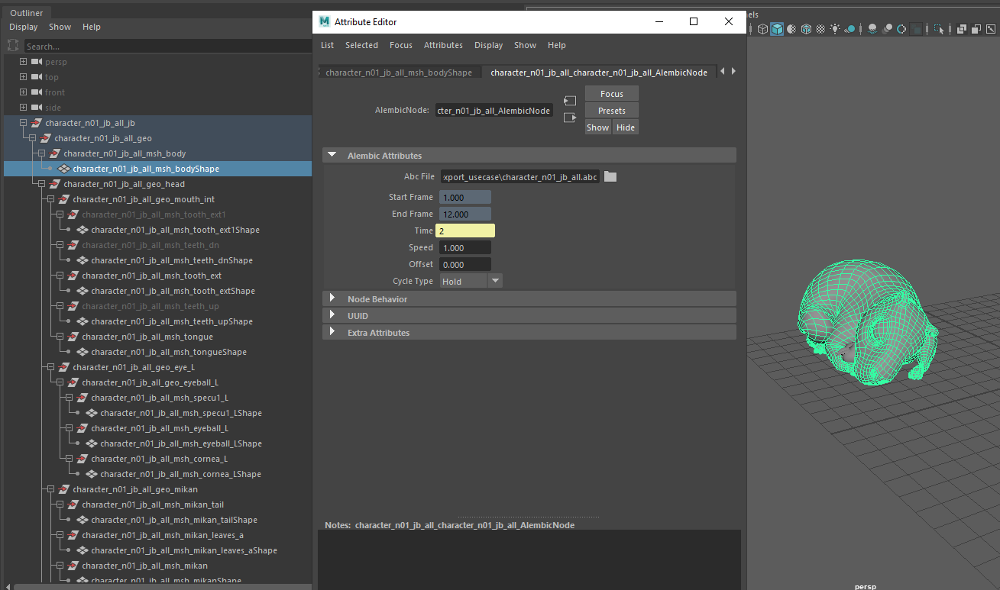
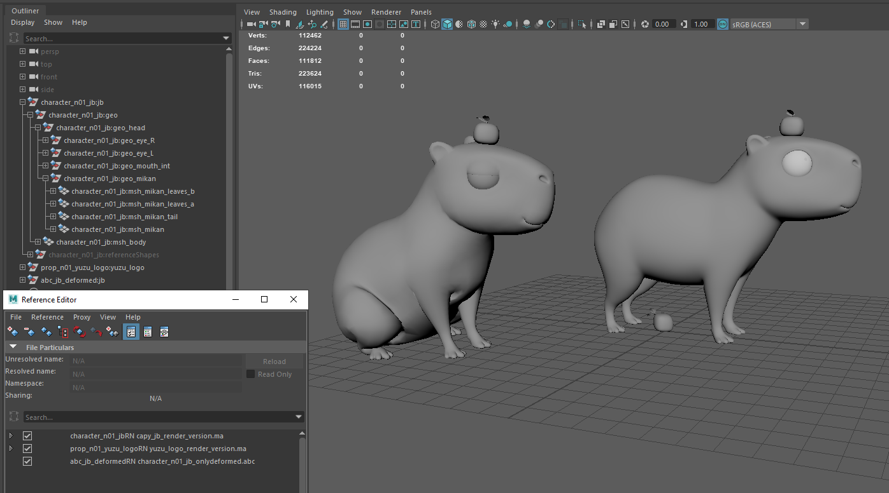
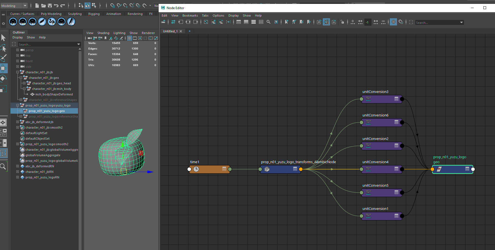
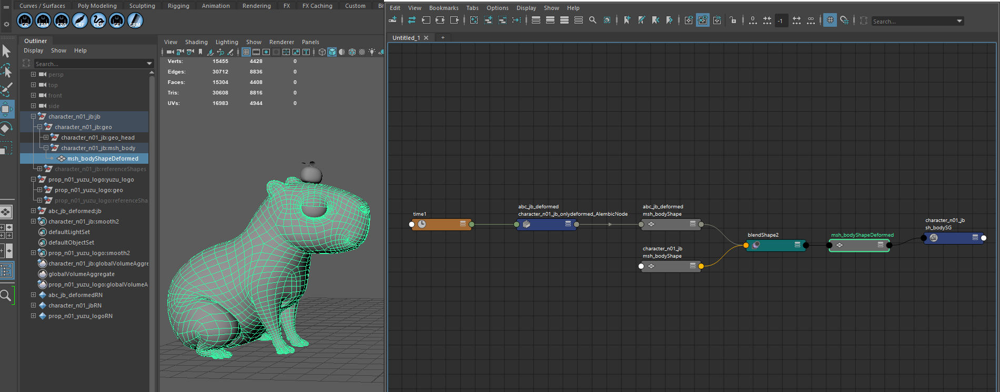

Case---
sidebar_position: 3
---
import Tabs from '@theme/Tabs';
import TabItem from '@theme/TabItem';

# Use case

# Use Case

## Exporting Animation to load it into Tangerine

Tangerine uses `.action` files to store animation data and set values.
You can generate these files from another software and import them into Tangerine as follows:

- Select the top node of an asset.
- Use the menu: `File > Load Action on Selected Asset...`
- Choose the `.action` file containing animation on controls that match the selected asset's controls.


### Uploading in Tangerine

Here is an example of a simple `.action` file containing set values and animation curves for an asset.
For more advanced examples, including importing constraints, dummies, and other animation types, ask for further guidance.

```python

file_path = "E:/TEMP/tangerine/Tangerine Demo 2025/api_tests/maya_layout/character_n01_jb.action"
action = Action("my_action")
action.load(file_path)
with get_document().modify('Apply Action') as modifier:
    action.apply(asset_node, modifier)
```
A shot can have an action per asset (values on controls), and shot's rig : dummies, constraints, clusters.
If needed, ask for sample to load the shot's rig values in python.

### Exporting `.action` from Maya: Simple Animation

Animations without deformations can be easily stored in a `.action` file using the following dictionary:

<Tabs>
  <TabItem value="from Maya to Tangerine" label="from Maya to Tangerine" default>

    ```python
    from math import cos, sin, radians

    plugRequired = "%s.%s" % (node, attribut)

    # We force conversion to weightedTangent because we need the exact wheight to give a norm to the Tang tangent
    cmds.keyTangent(plugRequired, e=1, weightedTangents=1)

    listValues = []
    times = cmds.keyframe(plugRequired, q=1)
    values = cmds.keyframe(plugRequired, q=1, valueChange=1)

    # since auto and spline mode can be slighlty different between tang and maya we convert these tangents
    # to custom to have the same shape
    tangentsITT = cmds.keyTangent(plugRequired, itt=1, q=1)
    tangentsOTT = cmds.keyTangent(plugRequired, ott=1, q=1)
    conv_type = ("auto", "spline", "plateau", "fixed")
    conv_in_tangent_index = [(i,) for i, itt in enumerate(tangentsITT) if itt in conv_type]
    conv_out_tangent_index = [(i,) for i, ott in enumerate(tangentsOTT) if ott in conv_type]
    cmds.keyTangent(plugRequired, e=1, itt="fixed", index=conv_in_tangent_index)
    cmds.keyTangent(plugRequired, e=1, ott="fixed", index=conv_out_tangent_index)

    tangentsIA = cmds.keyTangent(plugRequired, ia=1, q=1)
    tangentsOA = cmds.keyTangent(plugRequired, oa=1, q=1)
    tangentsInWeight = cmds.keyTangent(plugRequired, inWeight=1, q=1)
    tangentsOutWeight = cmds.keyTangent(plugRequired, outWeight=1, q=1)
    tangentsITT = cmds.keyTangent(plugRequired, itt=1, q=1)  # get a new once with converted type
    tangentsOTT = cmds.keyTangent(plugRequired, ott=1, q=1)  # get a new once with converted type

    # to take into consideration tangeant coeff are independant from eachother, or linked
    weightLocks = cmds.keyTangent(plugRequired, q=1, l=1)
    tangentsRatioOIT = 0.333333333  # no matter value, will be recompute in tang
    tangentsRatioOTT = 0.333333333  # no matter value, will be recompute in tang

    modeValueDict = {"linear": 0, "auto": 1, "custom": 2, "spline": 3, "flat": 4, "step": 5, "plateau": 1}

    for t in range(len(times)):
        keyTime = times[t]
        value = values[t]
        weightLock = float(weightLocks[t])
        if not animCurve:
            if (
                cmds.attributeQuery(attribut, node=node, attributeType=True) == "enum"
                or cmds.attributeQuery(attribut, node=node, attributeType=True) == "long"
            ):
                value = int(value)
            if cmds.attributeQuery(attribut, node=node, attributeType=True) == "bool":
                value = bool(value)

        if not type(value) is float:
            # do not need tangeant infos
            listValues.append(
                [keyTime, value]
            )  # inverse regarding float curve value (under) because developped like that in tang
            continue

        itt = tangentsITT[t]
        ott = tangentsOTT[t]
        left_tangent_mode = modeValueDict.get(itt, 2)
        right_tangent_mode = modeValueDict.get(ott, 2)

        ia = tangentsIA[t]
        oa = tangentsOA[t]
        inweight = tangentsInWeight[t]
        outweight = tangentsOutWeight[t]

        input_angle = radians(float(ia) + 180.0)
        output_angle = radians(float(oa))
        input_weight = inweight
        output_weight = outweight

        dxl = input_weight * round(cos(input_angle), 6)
        dyl = input_weight * round(sin(input_angle), 6)

        dxr = output_weight * round(cos(output_angle), 6)
        dyr = output_weight * round(sin(output_angle), 6)

        listValues.append(
            [
                value,
                keyTime,
                dxl,
                dyl,
                dxr,
                dyr,
                left_tangent_mode,
                right_tangent_mode,
                tangentsRatioOIT,
                tangentsRatioOTT,
                weightLock,
            ]
        )
    ```
  </TabItem>
</Tabs>

You can now store this Tangerine compatible animation dictionnaryle into a `.action`
```python
import json

actionDict = {"values": {}, "anims": {}}
actionDict["anims"][keyName] = listValues

jsonFile = open(jsonPath, "w")
json.dump(actionDict, jsonFile, indent=4)
jsonFile.close()
```

## Build a Shot in Pipeline

You can create a `Shot` object, which allows you to add all necessary attributes directly to the new object and save it to a file.
This approach skips loading data into Tangerine when it is not needed.

For example, if you want to quickly generate all `.shot` files for a sequ

```python
from tang_core.document.shot import Shot

# create shot instance
shot = Shot()

# set shot frames settings
shot.start_frame = 1
shot.end_frame = 15
shot.fps = 24

# add sound file to shot
shot.sound_path = "" # editing this attribute will reload the sound file

# add references to assets, using fullpath
shot.add_asset("prop_n01_yuzu_logo:yuzu_logo", {"file_path": "E:/TEMP/tangerine/Tangerine Demo 2025/api_tests/yuzu_logo.tang"})
shot.add_asset("character_n01_jb:jb", {"file_path": "E:/TEMP/tangerine/Tangerine Demo 2025/api_tests/capy_jb.tang"})

# saving to a file
filePath = "E:/TEMP/tangerine/Tangerine Demo 2025/api_tests/built_shot.shot"
shot.export_file(filePath)

```
:::tip
Editing the frame range will force the cache to reload.
In your workflow, if you need to change the frame range using the API, it is preferable to do this in the ASCII `.shot` file **before** loading it into Tangerine to minimize cache computation.

```python
import json

with open(filePath, "r") as fileIO:
    data = json.load(fileIO)

startFrame = data["start_frame"]
endFrame = data["end_frame"]
```
:::

## Exports from Tangerine to Maya Pipeline

To maximize efficiency, it makes sense to separate steps as much as possible, reducing dependencies between them.
For example, surfacing and UVs for rendering are generally independent of animation (except for animated UV features).

Here is a workflow to keep these steps independent: import the "renderable" version of an asset (UVs, shaders) into Maya and merge it in a controlled way with an Alembic file exported from Tangerine.

### Exporting usefull and optimised data for pipeline chain

Here is an example of connected the exported alembic into maya.
This in not the only way to do it, you would prefer another strategy depending on your pipeline.

Export sample :
`transforms` : contains only values and values lists on transforms node. Will concern only not deformed (bake on vertex) animations.
`all` : contains all animations, deformations on meshs and transforms animations.
`onlyDeformed` : contains transforms animations and meshs that have been deformed in the shot. Usefull to optimise alembic size, for example on sets.

#### Bake abc for parts of asset for external software

First exports almeibc files with custom content using tags

<details>

  <summary>Command sample exports</summary>

    This sample code is based on scene `three_capy.shot` available in demo package.
    We focus on two assets, `character_n01_jb:jb` and `prop_n01_yuzu_logo:yuzu_logo`.
    ```
    from tang_core.document.get_document import get_document

    def setBakeTagOnNode(bake, node, tagger=None):
        """Helper function to set the :param node: tags "do_bake" and "do_not_bake" according to the :param bakable:
        Perform tag existence check before tagging or untagging.
        if you intend to use this method on a lot of nodes, please provide a tagger with the tags "do_bake" and
            "do_not bake" already created, for performance reasons.

        :param bake: Wether the node shall be tagged bakable or not.
        :type bake: bool
        :param node: Tangerine node instance to change tags
        :type node: Node
        :param tagger: Tagger instance to avoid create a new one each time, defaults to None
        :type tagger: Tagger, Optional
        """

        if not tagger:
            tagger = get_document().tagger
            tagger.create_tag("do_not_bake", show_in_gui=False)
            tagger.create_tag("do_bake", show_in_gui=False)

        if bake:
            if not tagger.has_tag("do_bake", node):
                tagger.tag_node("do_bake", node)
            if tagger.has_tag("do_not_bake", node):
                tagger.untag_node("do_not_bake", node)
        else:
            if tagger.has_tag("do_bake", node):
                tagger.untag_node("do_bake", node)
            if not tagger.has_tag("do_not_bake", node):
                tagger.tag_node("do_not_bake", node)
    ```
    ```python
    from meta_nodal_py import Geometry, DisplayNode, Camera, CrossShapeTool
    from tang_core.abc import is_geom_mesh_modified_from_abc_source, AbcFilesKeepOpen
    from tang_core.document.get_document import get_document
    from tang_core.bake import bake

    document = get_document()

    capyJbAssetNode = document.root().find("character_n01_jb:jb")
    yuzuAssetNode = document.root().find("prop_n01_yuzu_logo:yuzu_logo")
    nodes = [capyJbAssetNode, yuzuAssetNode]

    tagger = document.tagger
    tagger.create_tag("do_not_bake", show_in_gui=False)
    tagger.create_tag("do_bake", show_in_gui=False)

    deformedGeometryNodes = []
    allGeometryChildren = []
    notGeoTranformsHierarchy = []

    with AbcFilesKeepOpen(document) as abc_files_keep_open:
        for node in nodes:
            nothingToBake = True
            for node in node.get_children():
                # disable bake on every part of rig without geometry. Clean and optimize exported alembic files.
                if not node.get_name() == "geo":
                    setBakeTagOnNode(False, node, tagger)
                    continue

                # Get only the "geo" children, to filter parsing on geometry in this sample.
                geoChildren = getAllHierarchy(node, nodeType="mesh")
                for child in geoChildren:
                    allGeometryChildren.append(child)
                    if isinstance(child, Geometry):
                        try:
                            if is_geom_mesh_modified_from_abc_source(child, abc_files_keep_open):
                                deformedGeometryNodes.append(child)
                        except TangValueError as err:
                            # If the node is a Locator, an exception is also raised,
                            inputPlug = child.mesh_in.get_plug_input()
                            if inputPlug and isinstance(inputPlug.get_node(), CrossShapeTool):
                                print("Ignoring locator %s", child.get_name())


    # if you need to export spline, add a bake tag. By default, not baked.
    # for node in nodes:
    #     children = getAllHierarchy(node, nodeType="spline")

    abcExportFolder = "E:/TEMP/Tangerine/Tangerine Demo 2025/api_tests/abc_export_usecase/"
    frameRangeParams = {"start_frame": 1, "end_frame": document.end_frame}

    # First export, we want only transforms in the hierarchy of "geo" node
    for node in allGeometryChildren:
        print(node.get_full_name())
        setBakeTagOnNode(False, node, tagger) # we add a tag on do_not_bake that we will use as a filter in bake abc file

    try:
        bake(
            filename=abcExportFolder + "character_n01_jb_transforms.abc",
            exclude_tag="do_not_bake",
            included_spline_tag="do_bake",
            roots=[capyJbAssetNode],
            write_uv=True, # possible to disblae uv writing
            document=document,
            sub_samples=[],
            write_full_matrix=True,
            **frameRangeParams
        )
    except AttributeError:
        print(
            "Error exporting node %s, please check the hierarchy", str([node.get_name() for node in nodes])
        )

    try:
        bake(
            filename=abcExportFolder + "prop_n01_yuzu_logo_transforms.abc",
            exclude_tag="do_not_bake",
            included_spline_tag="do_bake",
            roots=[yuzuAssetNode],
            write_uv=True, # possible to disblae uv writing
            document=document,
            sub_samples=[],
            write_full_matrix=True,
            **frameRangeParams
        )
    except AttributeError:
        print(
            "Error exporting node %s, please check the hierarchy", str([node.get_name() for node in nodes])
        )

    # Second export only deformed mesh for jb capy
    for node in deformedGeometryNodes:
        # other geometry still have the do_not_bake_tag.
        setBakeTagOnNode(True, node, tagger) # we add a tag on do_not_bake that we will use as a filter in bake abc file

    try:
        bake(
            filename=abcExportFolder + "character_n01_jb_onlydeformed.abc",
            exclude_tag="do_not_bake",
            included_spline_tag="do_bake",
            roots=[capyJbAssetNode],
            write_uv=True, # possible to disblae uv writing
            document=document,
            sub_samples=[],
            write_full_matrix=True,
            **frameRangeParams
        )
    except AttributeError:
        print(
            "Error exporting node %s, please check the hierarchy", str([node.get_name() for node in nodes])
        )
    # Third export all nodes in geometry
    for node in allGeometryChildren:
        # other geometry still have the do_not_bake_tag.
        setBakeTagOnNode(True, node, tagger) # we add a tag on do_not_bake that we will use as a filter in bake abc file

    try:
        bake(
            filename=abcExportFolder + "character_n01_jb_all.abc",
            exclude_tag="do_not_bake",
            included_spline_tag="do_bake",
            roots=[capyJbAssetNode],
            write_uv=True, # possible to disblae uv writing
            document=document,
            sub_samples=[],
            write_full_matrix=True,
            **frameRangeParams
        )
    except AttributeError:
        print(
            "Error exporting node %s, please check the hierarchy", str([node.get_name() for node in nodes])
        )

    try:
        bake(
            filename=abcExportFolder + "prop_n01_yuzu_logo_all.abc",
            exclude_tag="do_not_bake",
            included_spline_tag="do_bake",
            roots=[yuzuAssetNode],
            write_uv=True, # possible to disblae uv writing
            document=document,
            sub_samples=[],
            write_full_matrix=True,
            **frameRangeParams
        )
    except AttributeError:
        print(
            "Error exporting node %s, please check the hierarchy", str([node.get_name() for node in nodes])
        )
    ```
</details>

#### Build you maya scene

To build the renderable Maya scene, we reference:
- The renderable version of assets, containing shaders and associated UVs
- The `onlyDeformed` (or `_all`) Alembic from Tangerine for each asset



Applying animation to our renderable meshes is done in two steps:

1. **Merging "transforms" Alembic onto the renderable hierarchy**
    - This allows transforming "set values" on moved transforms
    - Creates a connection between an Alembic node (transform file) and the animated transforms
    - This process can be repeated multiple times to update animation and set values changes



2. **Connecting meshes of the renderable hierarchy to the deformed ones from Tangerine using blend shapes**
    - This allows handling potential differences in mesh hierarchy in a custom way (without using the AlembicImport algorithm directly)
    - Allows updating UVs on renderable meshes without affecting the animated parts




<details>
  <summary>Command sample exports</summary>

    This sample code is based on the scene `three_capy.shot` available in the demo package.
    You should have your renderable assets referenced in the Maya scene before merging Alembic animation data.

    


    ```python
    def disconnectCustomAttributes(attributes, topNode):
        """
        It is necessary to unplug attribute connections in destination before tu plus an alembic
        cause mergeAbc plug-in won't connect an attribute if there is a destination pluged in the attribute.
        """
        attributesDict = {}
        relativeNodes = cmds.listRelatives(topNode, ad=True, type="transform", f=True) or list()
        relativeNodes = cmds.ls(relativeNodes, exactType="transform", l=True)

        for node in relativeNodes:
            for attribute in attributes:
                if cmds.attributeQuery(attribute, n=node, ex=True):
                    connections = cmds.listConnections(node + "." + attribute, p=True, source=False)
                    if not connections:
                        continue
                    attributesDict.setdefault(node, []).append((attribute, connections))
                    for connection in connections:
                        cmds.disconnectAttr(node + "." + attribute, connection)

        return attributesDict

    def connectCustomAttributes(connectionsDict):
        """
        We reconnecte attribut desination after plug alembic node
        """
        for node, connectionAttributeList in connectionsDict.items():
            for attributeTuple in connectionAttributeList:
                attribute, connections = attributeTuple
                if not connections:
                    continue
                for connection in connections:
                    # test if we have connections from reference
                    if not cmds.listConnections(connection, d=False, s=True):
                        cmds.connectAttr(node + "." + attribute, connection)

    #
    alembicPath = "E:/TEMP/tangerine/Tangerine Demo 2025/api_tests/abc_export_usecase/prop_n01_yuzu_logo_transforms.abc"
    assetTopNode = "prop_n01_yuzu_logo:yuzu_logo"
    assetNamespace = "prop_n01_yuzu_logo"

    # AlembicImport plugin in maya does not know how to deal with attributs already connected, to merge a incoming alembic.
    # We desconnect it for merge, and reconnect them after. You can also use this to force a connection in your render scene, to drive values not from animated alembic from tangerine but another input.
    # searching for every custom attribute of the hierarchy.
    nodesWithCustomAttributs = (
    cmds.ls(
        [assetNamespace + ":c_*", assetNamespace + ":geo_*", assetNamespace + ":grp_*"],
        exactType="transform",
        l=True,
    )
    or list()
    )
    nodesWithCustomAttributs.append(assetTopNode)

    attributes = ["visibility"]
    for controler in nodesWithCustomAttributs:
        customAttributes = cmds.listAttr(controler, ud=True) or list()
        attributes.extend(customAttributes)

    attributesConnections = disconnectCustomAttributes(set(attributes), assetTopNode)

    cmd = 'AbcImport -mode import -connect "%s" "%s";' % (assetTopNode, alembicPath)
    print("executing command : %s" % cmd)
    alembicNode = mel.eval(cmd)

    connectCustomAttributes(attributesConnections)
    ```

    End up with connections made directly by AbcImport plugin
    
</details>


<details>
  <summary>Use blend shapes to transfer animation from Tangerine's Alembic to your renderable hierarchy.</summary>

    ```python
    topNodeAbc = "abc_jb_deformed:jb"
    namespaceAbc= topNodeAbc.split(":")[0]
    namespace = "character_n01_jb"
    childrenShapes = cmds.listRelatives(topNodeAbc, type=["mesh"], ad=True, f=True) or list()
    childrenShapes = list(set(childrenShapes) - set(cmds.ls(childrenShapes, l=True, io=True)))
    childrenMeshs = [x for x in childrenShapes if cmds.objectType(x) == "mesh"]


    # plug blendshape on original hierarchie
    for shape in childrenShapes:
        renderMesh = shape.replace(namespaceAbc + ":", namespace + ":")

        if cmds.objExists(renderMesh) and cmds.objectType(shape) == "mesh":

            # hack disconnect attribute in input
            meshVisibility = cmds.getAttr(renderMesh + ".visibility")
            inputConnections = (
                cmds.listConnections(shape + ".visibility", destination=False, p=True, c=True) or list()
            )
            # If one of the meshes in blendshape is hidden, the command fail. So we show the meshes, and we hide them after blendshape

            for x in range(0, len(inputConnections) - 1, 2):
                cmds.disconnectAttr(inputConnections[x + 1], inputConnections[x])

            # shape has to be visible to be deformable (specificity maya - alembic plugin)
            if meshVisibility is False:
                cmds.setAttr(shape + ".visibility", True)

            # plug blendshape
            try:
                blendShapeName = cmds.blendShape(shape, renderMesh)[0]
                cmds.blendShape(blendShapeName, edit=True, w=(0, 1))
            except RuntimeError:
                pass

            if meshVisibility is False:
                cmds.setAttr(shape + ".visibility", False)

    ```
    At the end, merge with blendshape creation creates a node graph similar to this one

    

</details>


### Add Preroll and Postroll Before Export

Some post-processing steps may require a preroll and postroll in the Alembic file.

When using the export command, you can choose a frame range that is different from the document's
[See bake documentation.](api#export-to-alembic)

```python
frameRangeParams = {"start_frame": -20, "end_frame":50}

bake(
    filename=outputPathLocal,
    exclude_tag="do_not_bake",
    included_spline_tag="do_bake",
    roots=nodes,
    write_uv=True,
    document=document,
    sub_samples=subsamples,
    write_full_matrix=writeFullMatrix,
    **frameRangeParams
)
```
Usually, you will need to add keys in the preroll section to ensure correct positions, for example when using physics engines.

You can change the frame range for your document by setting `document.start_frame` and `document.end_frame`.

If your animation is already validated and includes dynamics, the dynamics are calculated based on the document's first frame.
Changing the frame range will affect these calculations.

You can bake the dynamics before exporting to preserve the correct results.


```python
from tang_core.callbacks import Callbacks
from tang_core.document.get_document import get_document
from mikan.meta_nodal.lib import dynamic

dynamicControllers = []

document = get_document()

for assetNode in document.root().get_children():
    if not Callbacks().is_asset_node(document, assetNode):
        continue
    dynamicControllers += dynamic.filter_dynamic_controllers(
        Callbacks().get_all_controllers_in_asset(assetNode)
    )

alreadyBakedControllers = dynamic.filter_baked_dynamic_controllers(dynamicControllers)
dynamicControllers = [n for n in dynamicControllers if n not in alreadyBakedControllers]

if dynamicControllers:
    dynamic.bake_dynamic_controllers(dynamicControllers, document)
```

## Playblasting Options

### Add HUD on Image

Use a post-processing step to add a HUD to your images as needed.
A sample setup can be provided if required.
You can also use this post script to modify image padding as needed.


## Callback Processes

You can easily add custom code overrides, either using menu buttons or by specifying script paths on the command line.

### Add Custom Code Around Manual Actions

When you want to execute code after an action manually triggered from the UI:

- Replace the native menu button with your own [(see here).](general#custom-menus)
- Insert your custom code around the base action called by the button.

Below is the code executed behind the default items.

"File > Load Shot" : `` @sixtine complete
"File > Save Shot" : `Shot.export_shot_file(file_path, get_document())`
"File > New" : ``
"Playblast > With playblast Settings > Persp" : ``

### Add Custom Code Around Loading Actions

If you want to inject code during Tangerine's loading actions, you can use the command line and provide a script path to execute.
This script should contain the algorithm that defines the order of actions to perform.

You can also pass arguments to the script by adding them after the script path.
Tangerine will skip any arguments it does not recognize.

See the command line documentation for details, and refer to the demo package for an example.

<details>
  <summary>Demo package command</summary>

    ```
    "C:\Program Files\TeamTO\Tangerine\1.7.14\TangerineConsole.exe" --log_to_file --kernel release --no-gui -l debug "E:/TEMP/tangerine/Tangerine Demo 2025/hook.py" E:\work\sandbox\tang-docs\docs\runTangContainerBatch.py --firstarg --secondarg 42 --filePath "E:\TEMP\tangerine\Tangerine Demo 2025\api_tests\three_capy.shot"
    ```

    <details>
      <summary> Sample code for script with args</summary>

        ```
        # -*- coding: utf-8 -*-
        import os
        import sys

        try:
            from PySide2.QtWidgets import QApplication
        except ImportError:
            print("Tang modules not loaded")


        args = {}
        for element in " ".join(sys.argv).split(" --"):
            if not element.count(" ") >= 1:
                args[element.split(" ")[0]] = True
            else:
                args[element.split(" ")[0]] = " ".join(element.split(" ")[1:])


        firstArg = args.get("[firstarg]", None)
        secondarg = args.get("[secondarg]", None)
        filePath = args.get("filePath", None)


        # Develop here depending on your needs and args. Sample opening a document and printing a list of top nodes.

        # opening filepath
        from tang_core.document.shot import Shot
        from tang_core.document.get_document import get_document

        document = get_document()
        Shot.import_shot_files([filePath], document)

        # listing top nodes and printing nodes full name
        nodes = document.root().get_children()
        for node in nodes:
            print(node.get_full_name())

        # to match a pipeline idea, could be opening > playblasting > exporting > saving in another location
        ```
    </details>
</details>

## Manipulating .tang Files Using Python's JSON Library

During production, you may need to:
- Update a plug value for an asset that is used in hundreds of shots.
- Check which shots use a specific controller to evaluate the cost of modifying it.
- Change the start or end frame of multiple shots.

`.tang` files are JSON-readable, so you can search and manipulate their data using Python's built-in `json` library.

<Tabs>
  <TabItem value="List references" label="List references" default>
    ```python
    # -*- coding: utf-8 -*-
    import json

    filePath = "E:/TEMP/tangerine/Tangerine Demo 2025/api_tests/three_capy.shot"

    with open(filePath, "r") as tangFile:
        data = json.load(tangFile)
        allCurrentReferences = data.get("assets", None)
    referencesInfosDict = {
        reference.split(":")[0]: allCurrentReferences[reference]["file_path"] for reference in allCurrentReferences
    }

    print("\n".join("%s : %s" % (k, v) for k, v in referencesInfosDict.items()))
    ```
  </TabItem>
  <TabItem value="Get Plug values" label="Get plug values" default>
    ```python
    # -*- coding: utf-8 -*-
    import json

    def checkAnimationOnMikanVisibility(animFile):

        control = "world"
        plug = "mikan_vis"
        for asset in animFile["assets"]:
            # searching in animation curves if this plug has data
            plugAnimCurve = animFile["assets"][asset].get("action", []).get("anims", []).get("%s.%s" % (control, plug), [])
            if plugAnimCurve:
                # parsing anim curve values
                for keyData in plugAnimCurve:
                    print("%s key on %s at time %s" % (asset + "." + control + "." + plug, keyData[1], keyData[0]))
            else:
                # searching if their is a static value for this plug set
                plugStaticValue = animFile["assets"][asset].get("action", []).get("values", []).get("%s.%s" % (control, plug), [])
                if plugStaticValue:
                    print("%s visibility set to %s " % (asset + "." + control + "." + plug, plugStaticValue))

    filePath = "E:/TEMP/tangerine/Tangerine Demo 2025/api_tests/three_capy.shot"

    with open(filePath, "r") as sceneFile:
        animFile = json.load(sceneFile)

    animFile = checkAnimationOnMikanVisibility(animFile)
    ```
  </TabItem>
</Tabs>
